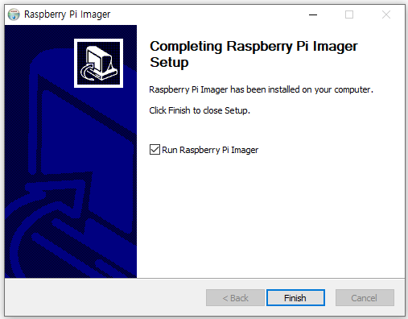

# 라즈비안 설치 

라즈베리파이의 운영체제인 라즈비안에 대해 알아보고 라즈베리파이 공식 홈페이지에서 제공하는 'Rasberry Pi Imager'를 이용해 SD카드에 라즈비안을 설치한다. 

+ PC에 'Raspberry Pi Imager' 설치하기

+ 'Raspberry Pi Imager'를 사용해서 SD카드에 라즈비안 설치하기

+ 라즈베리파이에 SD 카드 장착 및 부팅

 

라즈베리파이를 실행하기 위해서는 SD 카드에 라즈베리파이에서 사용할 OS를 넣어서 부팅해야 한다. 

라즈베리파이에는 라즈비안, 데비안 6.0, RiscOs 등 여러 가지 운영체제를 설치할 수 있지만, 가장 권장되는 시스템은 라즈비안(Rasbian) 이다. 

라즈비안은 특수 목적을 위해 변형된 Linux로, 라즈베리파이 재단에서 공식 개발한 라즈베리파이용 OS이다. 

 

PC에 'Rasberry Pi Imager'를 설치하여 실행해 라즈비안 이미지 SD카드를 만들어야 한다.  

라즈비안 이미지가 들어있는 SD카드를 라즈베리파이에 장착해 부팅하면 완성이다. 

아래 순서에 따라 진행하자. 

 

### 준비물

+ SD 카드
    
    8GB 이상, 16GB 권장

+ SD 카드 리더기 또는 리더기가 장착된 PC
  
 

### PC에 'Raspberry Pi Imager' 설치하기

SD 카드 리더기 또는 리더기가 장착된 PC에 'Raspberry Pi Imager'를 다운로드하여 설치한다.

https://www.raspberrypi.org/software

위의 링크에 접속해 파란 버튼을 눌러 'Rasberry Pi Imager'를 다운로드 한다. 

다운로드가 완료 되면 'Rasberry Pi Imager'을 실행한다. 

설치를 시작한다. 

설치가 완료되었다. 

 

### 'Raspberry Pi Imager'를 사용해서 SD카드에 라즈비안 설치하기

'Rasberry Pi Imager'를 실행하여 라즈베리파이 부팅을 위한 라즈비안 이미지 SD카드를 만든다.

Raspberry Pi와 함께 사용할 SD 카드를 PC 리더기에 넣고 'Raspberry Pi Imager'를 실행한다.

CHOOSE OS를 클릭해서 Raspberry Pi OS(32-bit)를 선택한다. 

'CHOOSE STORAGE'를 클릭해 라즈비안 이미지를 저장 할 저장소를 선택한다. 

이전에 삽입한 SD카드를 선택한다. 

'WRITE'버튼을 눌러 계속 진행한다. 

선택한 SD 카드의 내용이 모두 지워진다는 경고창이 뜬다. 

'YES'를 눌러 설치를 진행한다. 

설치가 완료되면 프로그램을 종료한다.  

'Raspberry Pi Imager'를 이용해 라즈비안 이미지 SD카드를 만드는 과정은 아래 링크를 통해 영상으로도 확인할 수 있다. 

https://youtu.be/ntaXWS8Lk34

 

### 라즈베리파이에 SD 카드 장착 및 부팅

PC에서 복사한 라즈비안 이미지를 라즈베리파이로 장착해 실행한다. 

'Raspberry Pi Imager'를 통해 라즈비안 이미지를 복사한 SD 카드를 라즈베리파이에 꽃는다. 

라즈베리파이의 전원을 연결하면 라즈비안이 설치된 라즈베리파이가 부팅된다. 

만일 이 화면이 뜨지 않으면 처음부터 다시 설치한다. 
