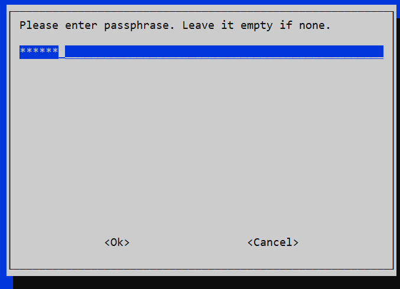

# 인터넷 연결

라즈베리파이의 터미널의 시스템 설정을 이용해 무선 인터넷을 연결하고 라즈베리파이의 IP 주소를 확인한다.

+ 라즈베리파이 인터넷 연결

+ 인터넷 연결 확인 및 IP 주소 확인

<br>

라즈베리파이를 사용하기 위해서는 각종 패키지와 소프트웨어의 추가 설치가 필요하다. 

라즈비언과 같은 리눅스에서 응용 소프트웨어를 설치하기 위해서는 인터넷에서 패키지 관리 소프트웨어를 다운로드받아 설치해야 한다. 

원격 제어를 사용하기 위해서도 인터넷 연결과 IP 확인이 필수이다. 

라즈베리파이는 유선랜과 무선랜 연결을 모두 지원한다. 

유선랜의 경우 공유기의 랜선을 꽂으면 자동으로 연결된다. 

일반적으로 사용하는 무선랜(WI-FI)의 연결 방법은 아래의 순서에 따라 진행한다. 

### 라즈베리파이 인터넷 연결

```
sudo raspi-config
```

터미널에서 위의 명령을 입력하여 설정으로 이동한다. 


첫 번째 'System Options'를 선택한다. 


첫 번째 'Wireless LAN'을 선택한다.  


네트워크 이름(SSID)을 입력하고 확인을 누른다. 



비밀번호를 입력하고 확인을 누른다. 


'Finish'를 눌러 설정에서 나간다. 

<br>

### 인터넷 연결 확인 및 IP 주소 확인

터미널에서 `iwconfig`를 입력하여 연결 된 무선랜을 확인한다. 

```
pi@raspberrypi:~ $ iwconfig

lo        no wireless extensions.

eth0      no wireless extensions.

wlan0     IEEE 802.11  ESSID:"N3C_Gangnam"
          Mode:Managed  Frequency:5.2 GHz  Access Point: 90:9F:33:BD:63:CE
          Bit Rate=86.6 Mb/s   Tx-Power=31 dBm
          Retry short limit:7   RTS thr:off   Fragment thr:off
          Power Management:on
          Link Quality=59/70  Signal level=-51 dBm
          Rx invalid nwid:0  Rx invalid crypt:0  Rx invalid frag:0
          Tx excessive retries:27  Invalid misc:0   Missed beacon:0
```

`ifconfig`를 통해서 IP 주소를 확인한다. 

```
pi@raspberrypi:~ $ ifconfig

eth0: flags=4099<UP,BROADCAST,MULTICAST>  mtu 1500
        ether dc:a6:32:f4:ca:15  txqueuelen 1000  (Ethernet)
        RX packets 0  bytes 0 (0.0 B)
        RX errors 0  dropped 0  overruns 0  frame 0
        TX packets 0  bytes 0 (0.0 B)
        TX errors 0  dropped 0 overruns 0  carrier 0  collisions 0

lo: flags=73<UP,LOOPBACK,RUNNING>  mtu 65536
        inet 127.0.0.1  netmask 255.0.0.0
        inet6 ::1  prefixlen 128  scopeid 0x10<host>
        loop  txqueuelen 1000  (Local Loopback)
        RX packets 5  bytes 284 (284.0 B)
        RX errors 0  dropped 0  overruns 0  frame 0
        TX packets 5  bytes 284 (284.0 B)
        TX errors 0  dropped 0 overruns 0  carrier 0  collisions 0

wlan0: flags=4163<UP,BROADCAST,RUNNING,MULTICAST>  mtu 1500
        inet 172.16.0.81  netmask 255.255.255.0  broadcast 172.16.0.255
        inet6 fe80::2341:fbf5:7218:9da0  prefixlen 64  scopeid 0x20<link>
        ether dc:a6:32:f4:ca:17  txqueuelen 1000  (Ethernet)
        RX packets 14436  bytes 2579156 (2.4 MiB)
        RX errors 0  dropped 0  overruns 0  frame 0
        TX packets 1014  bytes 142087 (138.7 KiB)
        TX errors 0  dropped 0 overruns 0  carrier 0  collisions 0
```
