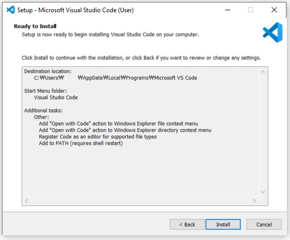

# 개발 환경 구축

PC와 라즈베리파이에 최적의 개발 환경을 구축해 쉽고 간편하게 개발을 시작하려고 한다. 

+ 라즈베리파이 원격 접속

    + 라즈베리파이 SSH 설정

    + PC에 PUTTY 설치 및 연결

    + PC에 WinSCP 설치 및 연결

+ PC에 VSCode 설치

+ 라즈베리파이에 Python과 GPIOZero 설치
  
    + Python 설치

    + GPIOZero 설치

<br>

## 라즈베리파이 원격 접속

라즈베리파이에 모니터와 키보드, 마우스를 연결해서 PC처럼 개발을 할 수는 있다. 

하지만 이처럼 번거로운 방법이 아닌 원격 접속을 통해 더욱 쉬운 방법을 사용하려 한다. 

원격 접속을 사용하면 모니터와 마우스 그리고 키보드의 연결을 해제하고 전원만 연결해서 사용할 수 있다. 

그뿐만 아니라 리눅스 운영체제가 기본적으로 다중 사용자를 지원하기 때문에 원격접속을 이용하면 두 명 이상의 사용자가 동시에 개별적인 화면을 보면서 라즈베이파이를 사용할 수 있다. 

<br>

원격 접속을 위해서 PC에 'Putty'라는 가상 단말기 프로그램을 설치한다. 

또한, WinSCP를 설치하여 윈도우와 라즈베리파이 사이에 파일을 안전하게 전송할 수 있다. 

그에 앞서, 원격 제어를 사용하기 위해 우선 라즈베리파이의 SSH 서버를 활성화 해야 한다. 

무선 공유기에 라즈베리파이와 컴퓨터 혹은 노트북이 연결된 경우 다음 순서에 따라 원격 접속을 실행한다. 

<br>

### 라즈베리파이 SSH 설정

SSH(secure Shell)를 통해 라즈베리파이의 명령 줄 인터페이스에 접근하는 방법이나 VNC나 RDP를 사용하여 라즈베리파이의 데스크톱 환경에 접근하는 방법이 있다. 

아래의 순서에 따라 SSH를 설정한다. 

<br>

```
sudo raspi-config
```

터미널을 열어 설정 명령어를 입력한다. 


위에서 세 번째 'Interface Options'를 선택한다. 


위에서 두 번째의 'SSH 설정'을 선택한다. 


SSH 서버 활성화에 'OK'를 선택한다. 


SSH 서버가 활성화 되었다는 알림을 확인한다. 


설정 종료 후 재부팅한다. 

<br>

### PC에 Putty 설치 및 연결

PUtty는 원격 접속을 돕는 프로그램으로 원도우 용 SSH 서버로 누구나 사용할 수 있는 Free Software이다. 

Putty를 이용하면 라즈베리파이를 원하는 곳에서 원격으로 접속하여 사용이 가능하다. 

아래의 링크를 통해 원격 접속을 할 PC에 Putty를 설치하여 실행한다. 

Putty 다운로드 : 

https://www.chiark.greenend.org.uk/~sgtatham/putty/latest.html


'The SSH and Telnet client itself - 64-bit x86: putty.exe`를 다운받는다. 


설치 후 Putty를 실행하면 위와 같은 화면이 나온다. 


HostName에 IP 주소를 입력하고 SSH를 선택한 후 아래의 Open을 누른다. 


Open을 눌러 위와 같은 창이 뜨면 라즈베리파이의 ID와 Password를 입력한다. 

초기 라즈베리파이의 ID와 Password : 

```
id : pi
Password : raspberry
```


ID와 Password입력 후 Enter를 누르면 위처럼 터미널 창에 접속한 것을 확인할수 있다. 

<br>

### PC에 WinSCP 설치 및 연결

WinSCP는 윈도우 용 FTP 클라이언트 프로그램으로, 누구나 사용할 수 있는 Free Software이다. 

WinSCP를 이용하면 라즈베리파이와 PC 사이에 파일을 빠르고 안전하게 주고 받을 수 있다. 

WinSCP는 PUTTY와 연동이 가능할 뿐만 아니라 설치와 사용 방법도 어렵지 않아 많이 사용되는 방법이다. 

순서에 따라 설치를 진행한다. 


https://winscp.net/eng/download.php

위의 링크에 접속해 초록 버튼을 눌러 다운로드 받는다. 


다운로드 받은 파일을 실행하여 설치를 시작한다. 


라이센스 동의를 하고 다음으로 넘어간다. 


기본 설정으로 선택하고 다음으로 넘어간다. 


설정을 선택하고 계속 진행한다. 


설정을 확인하고 설치를 시작을 누른다. 


PUTTY와 연결한다는 확인창이 뜨면 'Yes'를 누른다. 


라즈베리파이를 찾아 연결한다. 


설치가 완료되면 'Finish'를 누른다.


설치가 완료 된 프로그램을 실행해 로그인한다. 


라즈베리파이의 'Username'을 입력한다. 


라즈베리파이의 'Password'를 입력한다. 


로그인이 완료되면 위와 같이 라즈베리파일에 접속이 왼료된다. 

왼쪽이 PC, 오른쪽이 라즈베리파이의 탐색창이다. 

드래그 & 드롭으로 파일을 전송할 수 있고, 오른쪽 마우스를 눌러 파일 삭제와 생성이 가능하다. 

<br>

## PC에 VSCODE(Visual Studio Code) 설치

VSCode란 마이크로소프트가 윈도우, MacOS, 리눅스 용으로 개발한 무료 소스 코드 편집기로, 다양한 프로그래밍 언어를 지원하며 코드 편집에 최적화된 단순한 인터페이스를 가지고 있다. 

Python 스크립트를 작성하기 위해서 아래의 순서에 따라 VSCode를 설치한다. 

<br>


https://code.visualstudio.com/

위의 링크에 접속해 파란 버튼을 눌러 다운로드 한다. 


다운로드한 파일을 열어 설치를 시작한다. 


폴더의 경로를 지정해주고 다음을 누른다. 


다음을 눌러 설정을 게속 진행한다. 


다음을 눌러 설정을 완료한다. 



선택한 설정이 맞는지 확인하고 다음을 누른다. 


설정이 완료 되었으면 설치를 시작한다. 


설치가 완료 되었다. 이제 VSCode를 사용할 수 있다. 

<br>

## 라즈베리파이에 Python과 GPIOZero 설치

라즈베리파이에 GPIOZero와 Python을 설치한다.

<br>

### python 설치

파이썬은 프로그래밍 언어로 초보자도 보다 쉽게 접근할 수 있는 직관적이고 간편한 언어로 많은 사람들이 사용하고 있다. 

라즈비안에서도 파이썬을 기본 프로그래밍 언어로 사용한다. 

라즈베리파이에는 기본적으로 Python 2와 Python3가 설치 되어 있다. 

만일 설치 되어 있지 않은 경우 아래의 순서에 따라 설치한다. 

<br>

Python을 설치하기 이전 라즈비안을 최신 버전으로 업데이트 : 

```
sudo apt-get update
sudo apt-get upgrade
```

Python3 설치 : 

```
sudo apt-get install python3
```

설치 확인 및 버전 확인 : 

```
python3 -V
```

Python이 제대로 설치 되었다면 아래와 같이 확인 할 수 있다. 

```
pi@raspberrypi:~ $ python3 -V
Python 3.7.3
```

<br>

### GPIOZero 설치

GPIOZero는 라즈베리파이 재단에서 공식적으로 라즈베리파이에 포함시켜 배포하고 있는 GPIO 제어용 Python 라이브러리이다. 

GPIOZero 라이브러리를 사용하면 Python으로 GPIO 디바이스 제어를 쉽게 시작할 수 있다. 
아래의 문서를 참고하면 다양한 예시들을 확인할 수 있다. 

https://gpiozero.readthedocs.io/en/stable/

<br>

최신 라즈비안에는 GPIOZero가 기본적으로 설치 되어 있다. 

만일 설치 되어 있지 않은 경우 아래의 순서에 따라 설치한다. 

<br>

GPIOZero를 설치하기 이전 라즈비안을 최신 버전으로 업데이트 : 

```
sudo apt-get update
sudo apt-get upgrade
```

GPIOZero설치 : 

```
sudo apt install python3-gpiozero
sudo apt install python-gpiozero
```

아래와 같은 출력이 확인되면 GPIOZero가 설치 완료 되었다. 

```
pi@raspberrypi:~ $ sudo apt update
Get:1 http://raspbian.raspberrypi.org/raspbian buster InRelease [15.0 kB]
Get:2 http://archive.raspberrypi.org/debian buster InRelease [32.9 kB]
Get:3 http://archive.raspberrypi.org/debian buster/main armhf Packages [372 kB]
Fetched 420 kB in 3s (125 kB/s)
Reading package lists... Done
Building dependency tree
Reading state information... Done
2 packages can be upgraded. Run 'apt list --upgradable' to see them.

pi@raspberrypi:~ $ sudo apt install python3-gpiozero
Reading package lists... Done
Building dependency tree
Reading state information... Done
python3-gpiozero is already the newest version (1.5.1).
0 upgraded, 0 newly installed, 0 to remove and 2 not upgraded.

pi@raspberrypi:~ $ sudo apt install python-gpiozero
Reading package lists... Done
Building dependency tree
Reading state information... Done
python-gpiozero is already the newest version (1.5.1).
0 upgraded, 0 newly installed, 0 to remove and 2 not upgraded.
```