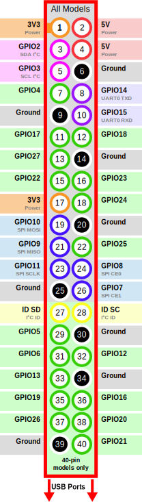
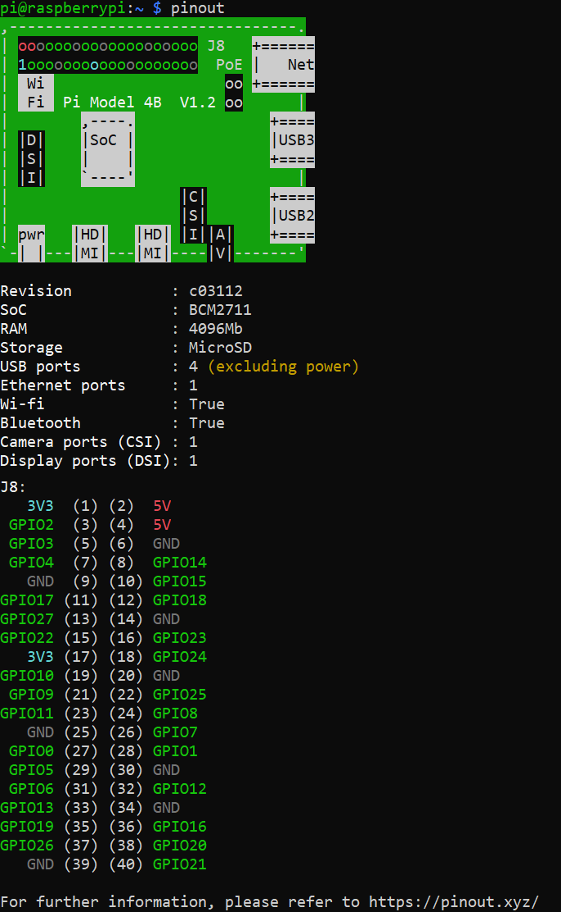

# 라즈베리파이 Pin Numbering

라즈베리파이 핀 넘버링 방식에 대해 알아본다. 

또, 각 핀의 역할과 사용 방법에 대해 알아본다. 

<br>


라즈베리파이의 가장자리에 있는 40개의 핀은 GPIO 핀으로 다양한 용도로 입출력을 설계할 수 있다. 

<br>

### 핀 번호 체계

40개의 핀들을 부르는 방법은 대표적으로 두 가지가 있다.

#### 물리적 핀 번호

라즈베리 보드상의 물리적인 순서대로 핀 순서로 번호를 매긴다. 

#### Broadcom(BCM) 핀 번호

Broadcom SOC 칩에서 사용하는 핀 이름을 사용하여 번호를 매긴다. 

<br>

### GPIOZero 라이브러리에서 사용하는 핀 넘버링 방식 및 표기법

아래는 모두 동일한 핀을 표현한 것 이다. 

```python
# GPIO 표기법
led = LED(17)
led = LED("GPIO17")

# BCM 표기법
led = LED("BCM17")

# 물리적 표기법
led = LED("BOARD11")

# wiringPi 표기법
led = LED("WPI0")

# header : number 표기법
led = LED("J8:11")
```
<br>

### 핀 타입 설명

모든 핀은 GPIO핀으로 사용이 가능하지만 특수 목적 핀으로도 사용할 수 있다. 




+ GPIO (General Purpose Input Output) 

    입출력을 제어하는 핀. 

    어떤 GPIO 핀이든 입력 또는 출력으로 설정할 수 있어 광범위한 목적으로 사용 할 수 있다. 

    입력으로 지정된 GPIO 핀은 높음 (3V3) 또는 낮음 (0V)으로 읽을 수 있다. 

    출력 핀으로 지정된 GPIO 핀은 높음 (3V3) 또는 낮음 (0V)으로 설정 할 수 있다. 

+ Grond 

    이상 전압에 발생하는 전류를 흘려 보내는 접지 핀. 

+ PWM 
    
    단순 O과 1이 아닌 펄스 폭 변조.

    + 소프트웨어 PWM : 모든 핀에서 사용 가능

    + 하드웨어 PWM : GPIO12, GPIO13, GPIO18, GPIO19

+ SPI (Serial Peripheral Interface Bus)

    직렬 주변기기 인터페이스 동기화 직렬연결. 

    + SPI0 : MOSI (GPIO10), MISO (GPIO9), SCLK (GPIO11), CE0 (GPIO8), CE1 (GPIO7)

    + SPI1 : MOSI (GPIO20), MISO (GPIO19), SCLK (GPIO21), CE0 (GPIO18), CE1 (GPIO17), CE2 (GPIO16)

+ I2C (Inter-Integrated Circuit)

     저속의 주변기기를 연결하기 위해 사용. 

     + Data: (GPIO2), Clock (GPIO3)

     + EEPROM Data: (GPIO0), EEPROM Clock (GPIO1)

+ Serial

    시리얼 통신 핀. 

    + TX (GPIO14), RX (GPIO15)

<br>

터미널에 `pinout` 명령어를 입력하면 다음과 같이 핀 정보를 확인 할 수 있다. 

