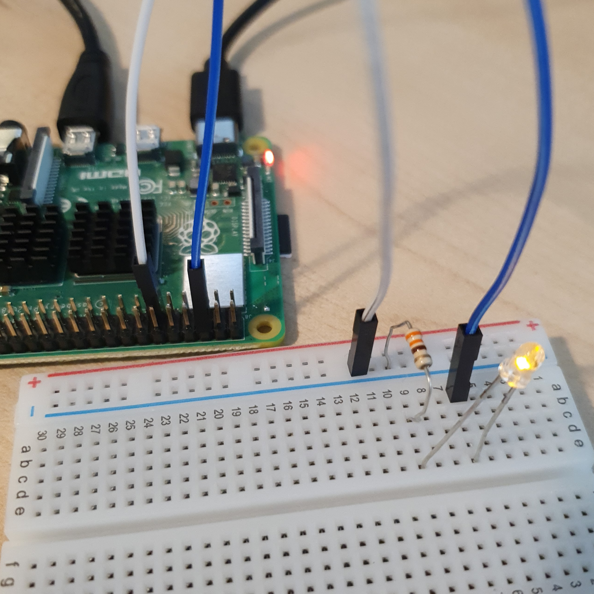

# LED 연결

라즈베리파이에 LED를 연결하여 이를 제어하는 Python스크립트를 작성해 LED의 불을 키고 끄는 장치를 만든다.  

<br>

### 준비물


+ LED

    LED는 빛을 발산하는 부품이다. 

    매우 작은 전력으로도 오래가는 부품이다. 

    LED의 양극(Cathode)은 다리가 좀 더 길고, 음극(Anode)은 LED 케이스에 납작한 부분이 있다. 

+ Resistor

    저항은 전류의 흐름을 방해하는 부품이다. 

    저항의 값이 높을수록 흐르는 전류의 양은 줄어든다. 

    LED에 들어가는 전류의 양을 조절하여 LED의 밝기를 조절한다. 

    저항값은 저항에 색칠되어있는 색으로 확인 할 수 있다. 

<br>

### 결선도


<br>

### 결선방법

LED의 음극은 GND에 연결하고, 양극은 저항을 통해 GPIO 핀으로 연결한다. 



<br>

### 예제코드 1

연결된 LED가 1초에 한 번씩 깜빡인다. 

```python
from gpiozero import LED
from time import sleep

red = LED(17)

while True:
    red.on()
    sleep(1)
    red.off()
    sleep(1)
```
아래의 코드도 같은 결과를 보여준다. 

```python
from gpiozero import LED
from signal import pause

red = LED(17)

red.blink()

pause()
```

#### 결과 


LED가 1초에 한 번씩 깜빡인다. 

<br>

### 예제코드 2

밝기를 단계별로 제어한다. 

```python
from gpiozero import PWMLED
from time import sleep

led = PWMLED(17)

while True:
    led.value = 0
    sleep(1)
    led.value = 0.5
    sleep(1)
    led.value = 1
    sleep(1)
```

#### 결과 


LED의 파란 불이 설정한 수치에 따라 밝기가 제어된다. 


### 예제코드 3

밝기를 연속적으로 제어해 LED가 점점 밝아진다. 

```python
from gpiozero import PWMLED
from signal import pause

led = PWMLED(17)

led.pulse()

pause()
```

#### 결과 


LED의 파란 불이 점점 밝아진다. 