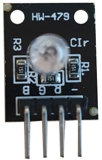
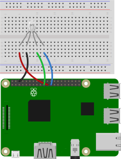
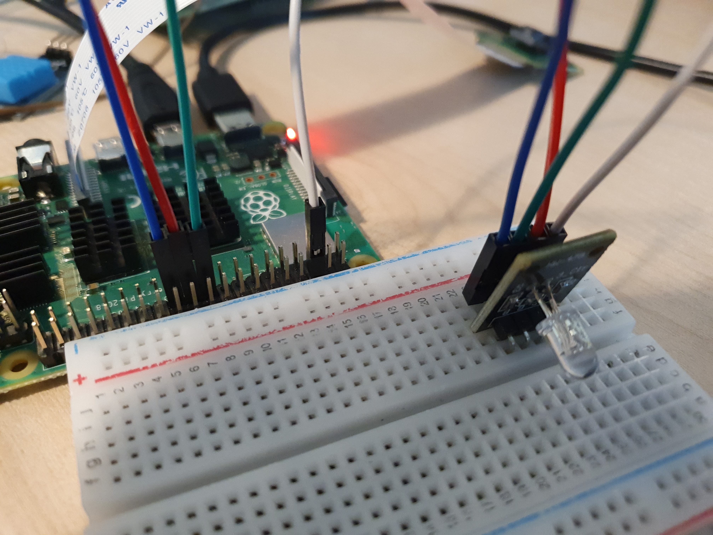

# RGB LED를 연결

RGB LED를 연결해 다양한 색을 출력하는 장치를 만들고, RGBLED를 제어하는 코드에 대해 알아본다. 

### 준비물



+ RGB LED

    빨간색, 초록색, 파란색 3개의 LED를 하나로 연결한 LED. 

    단일 LED와는 다르게 총 256가지의 색을 낼 수 있다. 

    작동 전압 : 5V

    공통 단자에 -를 연결하고, 나머지 단자에 +를 연결하면 빛이 난다. 

    <br>

    RGBLED에는 4개의 핀이 있다. 

    + R

        RGBLED의 RED 값을 전달하는 핀. 

        GPIO에 연결. 

    + G

        RGBLED의 GREEN 값을 전달하는 핀. 

        GPIO에 연결. 

    + B

        RGBLED의 BLUE 값을 전달하는 핀. 

        GPIO에 연결. 

    + GND

        Grond에 연결. 


<br>

### 결선도



<br>

### 결선방법

R, G, B 를 각각 GPIO 핀에 연결하고, GND 핀을 연결한다. 



<br>

### 예제코드

R, G, B의 밝기를 조절해 다양한 색을 출력한다. 

```python
from gpiozero import RGBLED
from time import sleep

led = RGBLED(red=9, green=10, blue=11)

led.red = 1  # 빨강
sleep(1)
led.red = 0.5  # 연한 빨강
sleep(1)

led.color = (0, 1, 0)  # 초록
sleep(1)
led.color = (1, 0, 1)  # 마젠타
sleep(1)
led.color = (1, 1, 0)  # 노랑
sleep(1)
led.color = (0, 1, 1)  # 연파랑
sleep(1)
led.color = (1, 1, 1)  # 하얀색
sleep(1)

led.color = (0, 0, 0)  # 끔
sleep(1)

# 점점 진해지는 파랑
for n in range(100):
    led.blue = n/100
    sleep(0.1)
```

<br>

### 결과


순서에 따라 다양한 색이 출력 된다. 

<br>

### 코드 설명 

#### RGBLED

```
classgpiozero.RGBLED(red, green, blue, active_high=True, initial_value=(0, 0, 0), pwm=True)
```

RGBLED의 밝기를 제어하고 확장한다. 

공통 음극을 Grond에 연결하고 R, G, B 핀을 각 각 GPIO 핀에 연결한다. 

Parameters : 

+ red (int or str)

    RGB LED의 빨간색 구성 요소를 제어하는 GPIO 핀.

+ green (int or str)

    RGB LED의 초록색 구성 요소를 제어하는 GPIO 핀.

+ blue (int or str)

    RGB LED의 파랑색 구성 요소를 제어하는 GPIO 핀.

+ active_high (bool)

    True (default) - 공통 음극을 사용하는 경우. 

    False - 공통 양극을 사용하는 경우

+ initial_value (Color or tuple)

    RGB LED의 초기 색상. 
    
    기본 값은 검은색 (0, 0, 0).

+ pwm (bool)

    True (default) - RGBLED 구성요소에 대해 각각의 인스턴스 생성. 
    
    False - 부드러운 색상 변화를 방지. 일반 LED에 대한 인스턴스 생성. 

<br>

##### blink 

```
blink(oon_time=1, off_time=1, fade_in_time=0, fade_out_time=0, on_color=(1, 1, 1), off_color=(0, 0, 0), n=None, background=True)
```

RGBLED를 반복적으로 켜고 끈다. 

Parameters : 

+ on_color (Color or tuple)

    LED가 켜져 있을 때 사용할 색.

    기본값 흰색. 

+ off_color (Color or tuple)

    LED가 꺼져 있을 때 사용할 색.

    기본값 검은색. 

<br>

##### off()

LED를 끈다.

LED를 검은색으로 설정하는 것과 동일. 

<br>

##### on()

LED를 켠다. 

LED를 흰색으로 설정하는 것과 동일. 

<br>

##### pluse()

```
pulse(fade_in_time=1, fade_out_time=1, on_color=(1, 1, 1), off_color=(0, 0, 0), n=None, background=True)
```

RGBLED가 페이드 인 페이드 아웃을 반복. 

Parameters : 

+ on_color (Color or tuple)

    LED가 켜져 있을 때 사용할 색.

    기본값 흰색. 

+ off_color (Color or tuple)

    LED가 꺼져 있을 때 사용할 색.

    기본값 검은색.
