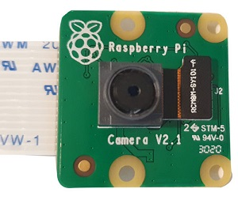
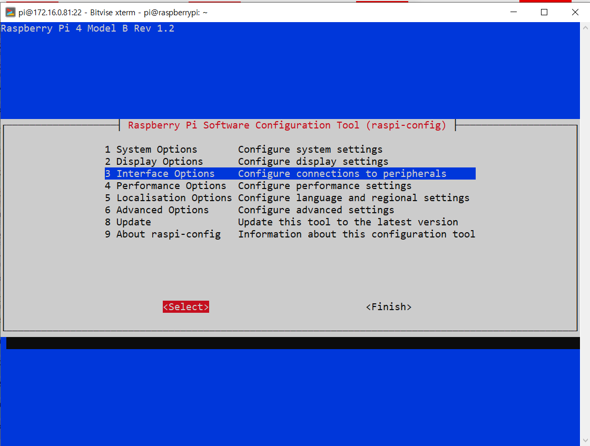
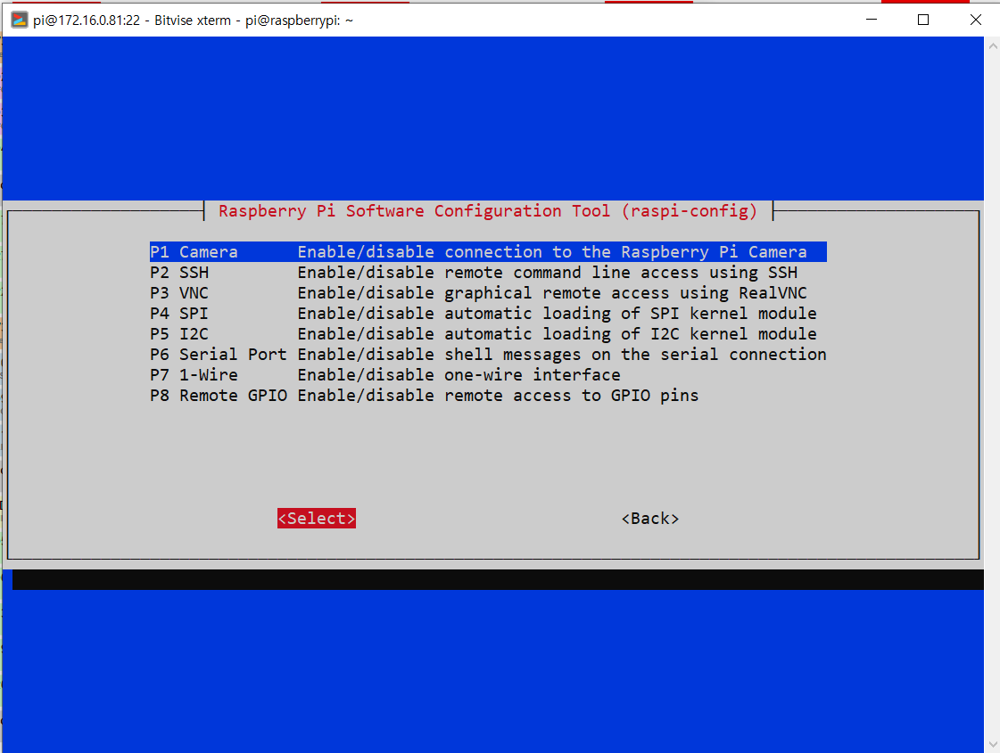
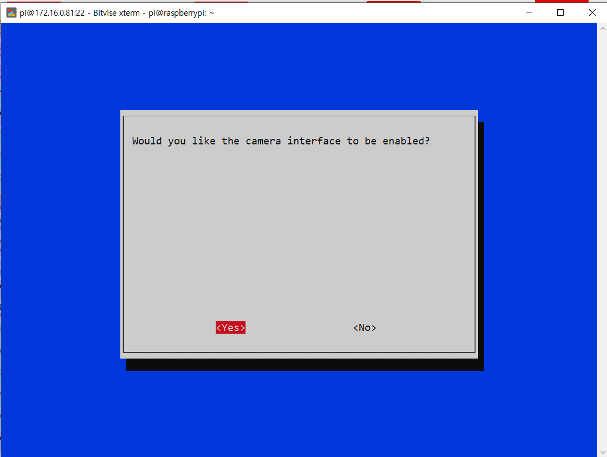
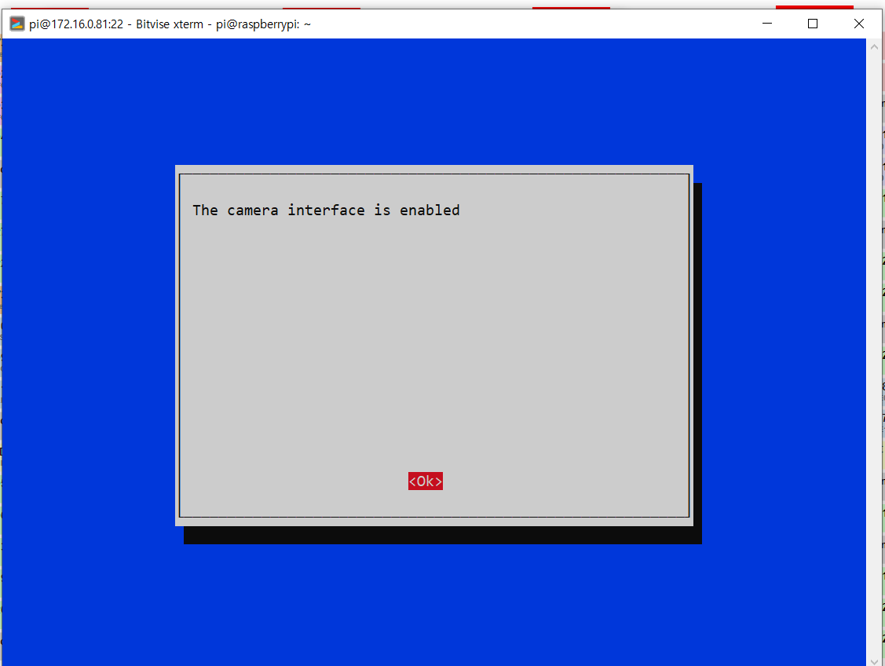
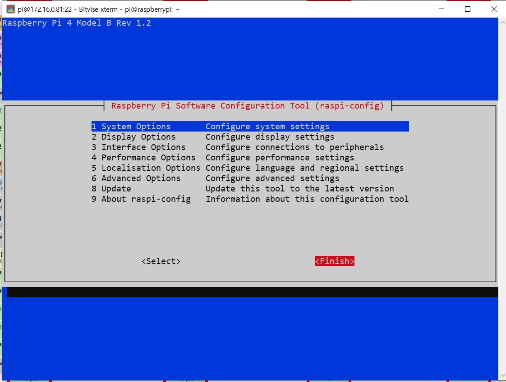
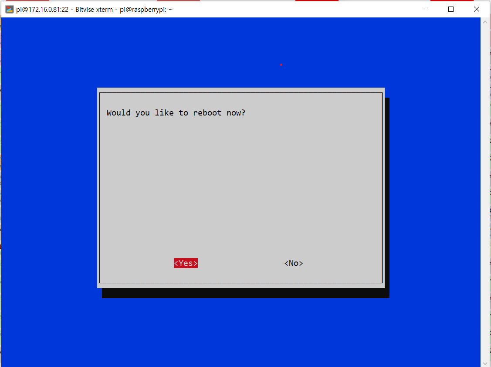

# 라즈베리파이 카메라 설정

라즈베리파이의 PICamera를 사용하기 위해 라즈베리파이의 설정에서 카메라 사용을 허용한다. 

<br>

### Pi Camera



Pi Camera를 사용하기 위해선 라즈베리파이에서 설정을 해야 한다. 

아래의 순서에 따라 카메라 사용 전 필요한 설정을 준비한다. 

<br>

### 카메라 사용 설정

라즈베리파이를 최신 버전으로 업그레이드 : 

```
sudo apt-get update
sudo apt-get upgrade
```

터미널을 이용해 설정 : 

```
sudo raspi-config
```



세 번째의 'Interface Option'을 선택한다. 



카메라 설정 선택한다. 



카메라 활성화를 허용한다. 



카메라가 활성화 되었다. 



설정을 끝낸다. 



종료 후 재부팅한다. 

<br>

https://picamera.readthedocs.org/

위의 링크를 통해 파이 카메라의 더 많은 정보를 확인할 수 있다. 