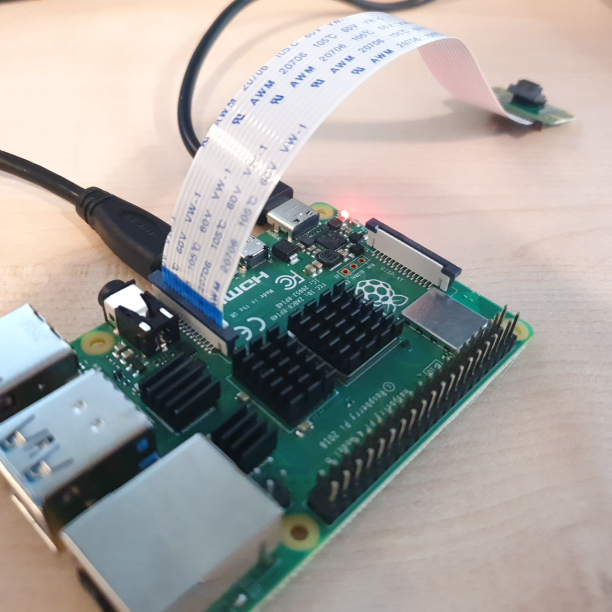

# 라즈베리파이 카메라 연결

라즈베리파이에 PICamera를 연결하여 사진을 찍는다. 

사진 촬영과 영상 촬영 등 여러가지 카메라 제어 옵션들에 대해 알아보자. 

<br>

라즈베리파이 카메라 모듈은 라즈베리파이용으로 맞춤 설계된 모델이다. 



라즈베리파이에서 PiCamera를 연결할 수 있는 카메라 모듈 포트를 찾는다. 

포트의 플라스틱 클립 가장자리를 조심스럽게 위로 당긴다. 

카메라 케이블 연결선 밑에 파란 테이프로 감겨 있는 부분을 카메라 포트에 연결한다. 

파란색 테이프가 있는 부분을 Ethernet 커넥터 방향으로, 납이 있는 부분을 HDMI 방향으로 꽂는다. 

플라스틱 클립을 다시 제자리에 넣는다. 

라즈베리파이의 전원을 연결해 부팅한다. 

<br>

### raspistill로 사진 촬영

raspistill은 Raspberry Pi 카메라 모듈로 스틸 사진을 찍기 위한 커맨드 라인이다. 

raspistill의 기본 사용 : 

```
raspistill -o image.jpg
```

터미널에 다음 명령을 입력하여 스틸 사진을 찍고 저장한다. 

저장위치는 /home/pi 파일명은 image로 저장된다. 

<br>

```
--width, -w             이미지 폭 설정

--height, -h            이미지 폭 설정

--output, -o            출력 파일명

--encoding, -e          출력 파일 사용을 위한 인코딩

--timeout, -t           카메라가 촬영하고 꺼질 때까지의 시간

--keypress, -k          키프레스 모드
```


<br>

### raspivid로 영상 촬영

raspivid Raspberry Pi 카메라 모듈로 비디오를 찍기 위한 커맨드 라인이다. 

raspivid 기본 사용 :

```
raspivid -o video.h264
```

5초간 촬영 후 H264로 저장된다. 

<br>

```
--width,    -w      이미지 폭 설정

--height,   -h      이미지 폭 설정

--bitrate,  -b      비트레이트 설정

--output,   -o      출력 파일명

--framerate, -fps   초당 프레임 설정

--keypress, -k      Enter 키를 누를 때 마다 녹화를 멈추거나 재개

--timeout, -t       프로그램이 실행되고 정지되는 시간
```

<br>

### 예제

```
raspistill -t 2000 -o image.jpg -w 640 -h 480
```

사진의 해상도를 변경한다. 

```
raspistill -t 2000 -o image.png –e png
```

사진을 png로 저장한다. 

```
raspistill -t 0 -k -o my_pics%02d.jpg
```

카메라를 영원히 실행하며, Enter를 누르면 사진을 찍는다. 

```
raspivid -t 5000 -o video.h264 -b 3500000
```

3.5Mbits/s로 지정한 특정 비트율로 5초짜리 클립을 녹화한다. 

```
raspivid -t 5000 -o video.h264 -f 5
```

5fps로 지정한 특정 프레임률로 5초 짜리 클립을 녹화한다.