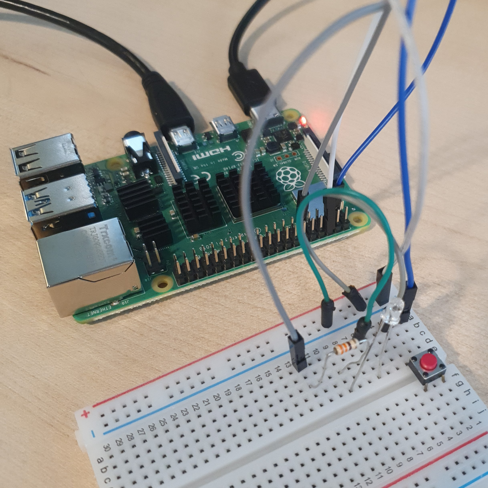

# 버튼으로 LED 제어

버튼을 연결해 LED의 불빛을 켰다 껐다 제어한다. 

### 준비물


+ 버튼

+ LED

+ Resistor

<br>

### 결선도


<br>

### 결선방법

버튼 한 쪽을 GPIO 핀에 연결하고 다른 한쪽은 저항을 통해 Ground로 연결한다. 

LED의 음극은 Ground로 연결하고, 양극은 저항을 통해 GPIO 핀에 연결한다.



<br>

### 예제코드

버튼을 누르면 LED가 켜지고, 버튼을 떼면 LED가 꺼진다. 

```python
from gpiozero import LED, Button
from signal import pause

led = LED(17)

button = Button(2)
# 버튼 핀을 지정한다. 

button.when_pressed = led.on
# 버튼을 누르면 LED가 켜진다. 

button.when_released = led.off
# 버튼을 떼면 LED가 꺼진다. 

pause()
```

<br>

### 결과 


버튼을 누르면 LED가 켜지고 떼면 LED가 꺼진다. 