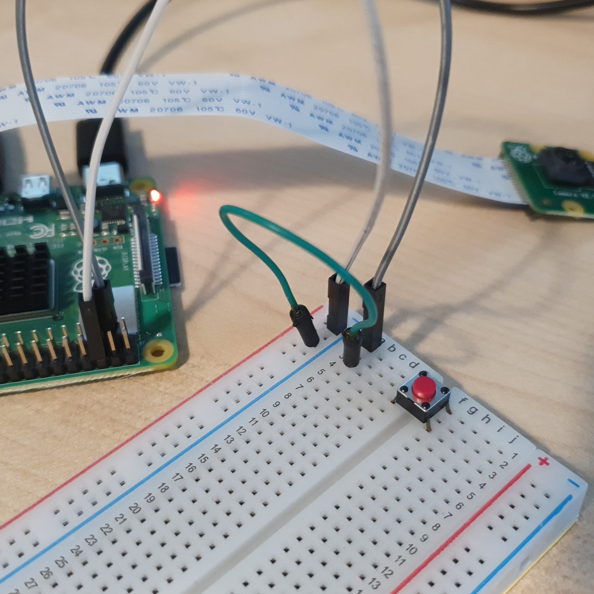

# 버튼으로 카메라 제어

버튼을 연결하여 버튼을 누르면 5초 후 PICamera를 통해 사진을 찍는 장치를 만든다. 

<br>

### 준비물

+ Button

+ PiCamera

<br>

### 결선도


<br>

### 결선방법

PiCamera를 연결한다. 

버튼을 연결한다. 



<br>

### 예제코드

버튼을 누르면 사진이 찍힌다. 

사진은 라즈베리파이의 pi 폴더에 날짜와 시간과 함께 사진이 저장된다. 

```python
from gpiozero import Button
from picamera import PiCamera
from datetime import datetime
from signal import pause

button = Button(2)

camera = PiCamera()

def capture():
    timestamp = datetime.now().isoformat()
    camera.capture('/home/pi/%s.jpg' % timestamp)
    # 파일명에 현재 시간이 저장된다. 

button.when_pressed = capture
# 버튼을 누르면 capture가 실행되면서 사진이 찍힌다. 

pause()
```

### 결과


버튼을 누르고 5초 후 사진이 찍힌다. 