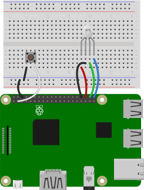
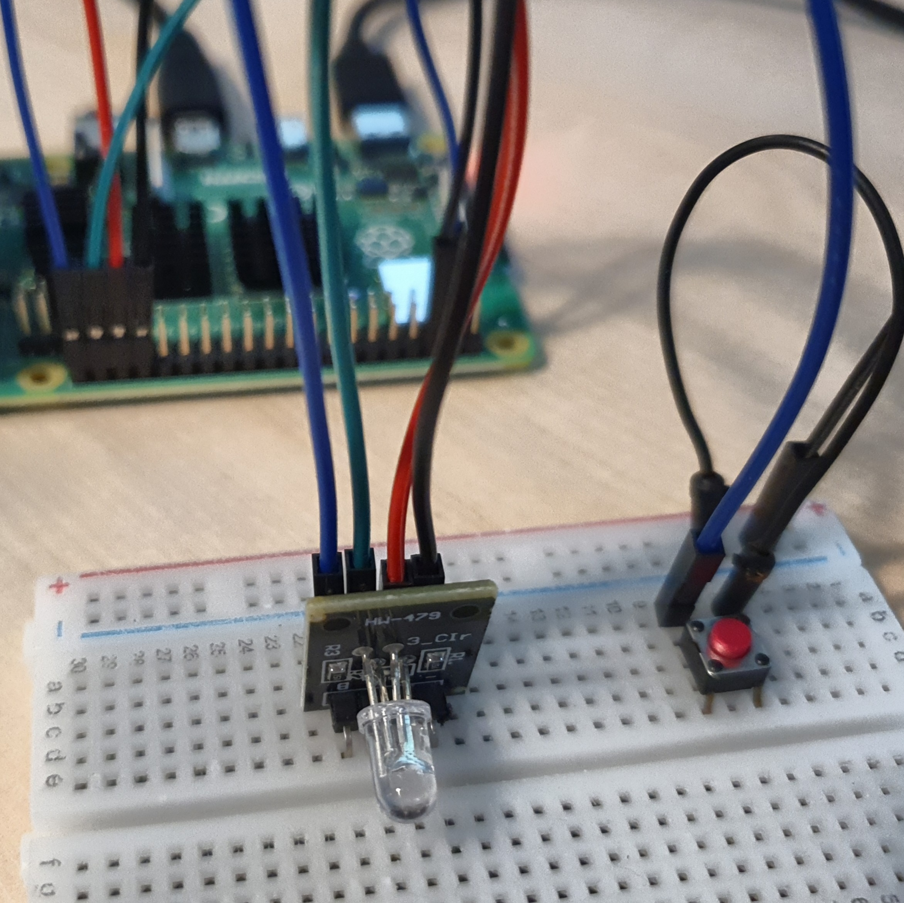
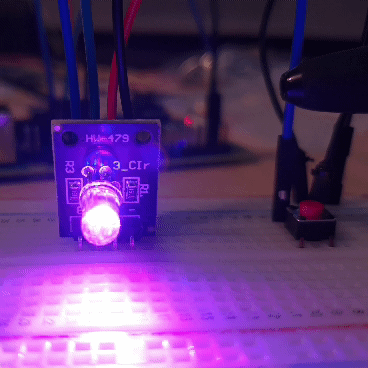

# 버튼으로 RGB LED 제어

버튼을 연결해 버튼을 누르면 RGBLED의 불빛이 바뀌는 장치를 만든다. 

### 준비물

+ RGBLED

+ Button

<br>

### 결선도



<br>

### 결선방법

Button과 RGBLED를 연결한다. 



<br>

### 예제코드

버튼을 누르면 RGBLED의 색이 차례대로 바뀐다. 

```python
from gpiozero import Button
from gpiozero import RGBLED
from time import sleep
from signal import pause

button = Button(2)
led = RGBLED(red=16, green=20, blue=21)

def lighton():
    led.color = (0, 1, 0)  
    sleep(1)
    led.color = (1, 0, 1) 
    sleep(1)
    led.color = (1, 1, 0) 
    sleep(1)
    led.color = (0, 1, 1) 
    sleep(1)
    led.color = (1, 1, 1)  
    sleep(1)
    led.color = (0, 0, 0)  
    sleep(1)

button.when_pressed = lighton
button.when_released = led.off

pause()
```

<br>

### 결과



버튼을 누르면 RGBLED의 색이 바뀐다.