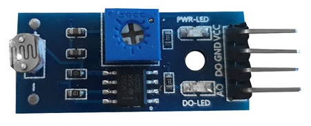

# 조도센서

빛의 양을 확인하는 조도센서의 원리에 대해 자세히 알아본다. 

조도센서의 4가지 핀에 대해 알아보고 각각의 역할을 이해한다. 

 

조도센서는 빛의 양을 측정하는 센서이다. 

조도센서는 빛에 반응하는 화학물질인 황화카드뮴(Cadmium Sulfide)을 소자로 제작하여 cds센서라고도 한다. 

황화카드뮴에 빛이 많이 들어오면 전도율이 높아져 저항이 작아지고, 빛이 적게 들어오면 저항이 커지는 성질을 이용하여 빛의 양을 측정한다. 

조도센서는 밝으면 약 1K 옴의 저항값을 내보내고 어두우면 약 50K 옴 까지의 저항값을 내보내 입력값을 조절한다. 

일상생활에서는 어두워질 때 밝아지는 가로등과 자동차의 헤드라이트 등에서 많이 쓰인다. 

 

조도센서에는 4개의 핀이 있다. 

+ VCC
    
    전원을 연결하는 핀.

    3V3핀에 연결. 

+ GND

    Ground 핀으로 회로를 접지하는데 사용. 

    GND핀에 연결.

+ DO 

    Digital Output의 약자로, 디지털 신호를 보낸다. 

    0 ~ 1023 사이의 값 전달.

    GPIO핀에 연결. 

+ AO 
  
    Analog Output의 약자로, 아날로그 신호를 보낸다. 

    GPIO 핀에 연결. 

