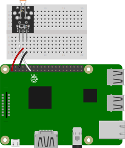

# 조도센서 연결

조도센서를 연결하여 빛을 감지하여 상태를 확인한다. 

조도센서를 제어하는 LightSensor 코드에 대해 알아보자. 

<br>

### 준비물 

+ 조도센서 

<br>

### 결선도



<br>

### 결선방법

전원을 3v3에 연결한다. 

GND 핀을 Ground에 연결한다. 

신호(-)핀을 GPIO핀에 연결한다. 


<br>

### 예제코드 

조도센서로 빛을 감지하여 밝으면 "It's light! :)" 를 출력하고, 어두우면 "It's dark :(" 를 출력한다. 

```python
from gpiozero import LightSensor

sensor = LightSensor(17)

while True:
    sensor.wait_for_light()
    print("It's light! :)")
    sensor.wait_for_dark()
    print("It's dark :(")
```

<br>

### 결과 

```
It's dark :(
It's light! :)
It's dark :(
It's light! :)
```

조도센서로 감지한 빛의 결과가 위와 같이 출력된다. 

<br>

### 코드설명

#### LightSensor (LDR)

```
classgpiozero.LightSensor(pin, queue_len=5, threshold=0.1, partial=False)
```

Parameters:	

+ pin (int or str)

    센서가 연결된 핀. 

+ queue_len (int)

    읽은 값을 저장하는데 사용되는 대기열의 길이. 

    기본값은 5. 

+ threshold (float)

    설정한 값이 넘으면 빛이 있는 것으로 간주한다. 

    기본값은 0.1. 

+ partial (bool)

    False (기본값) - 대기열에 모든 값이 채워지지 않을 경우 값을 반환하지 않음.
    
    True - 생석 직후 값이 필요한 경우 즉시 반환. 

<br>

#### wait_for_dark(timeout=None)

센서가 비활성화 되거나 시간 초과에 도달 할 때 까지 일시중지. 

Parameters:

+ timeout (float or None)

    대기 시간. 기본값은 None으로 무기한 기다림. 

<br>

#### wait_for_light(timeout=None)

센서가 활성화 되거나 시간 초과에 도달 할 때 까지 일시중지. 

Parameters:

+ timeout (float or None)

    대기 시간. 기본값은 None으로 무기한 기다림. 