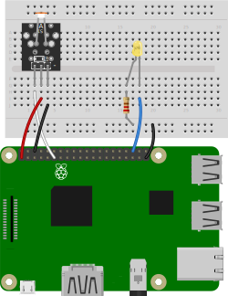
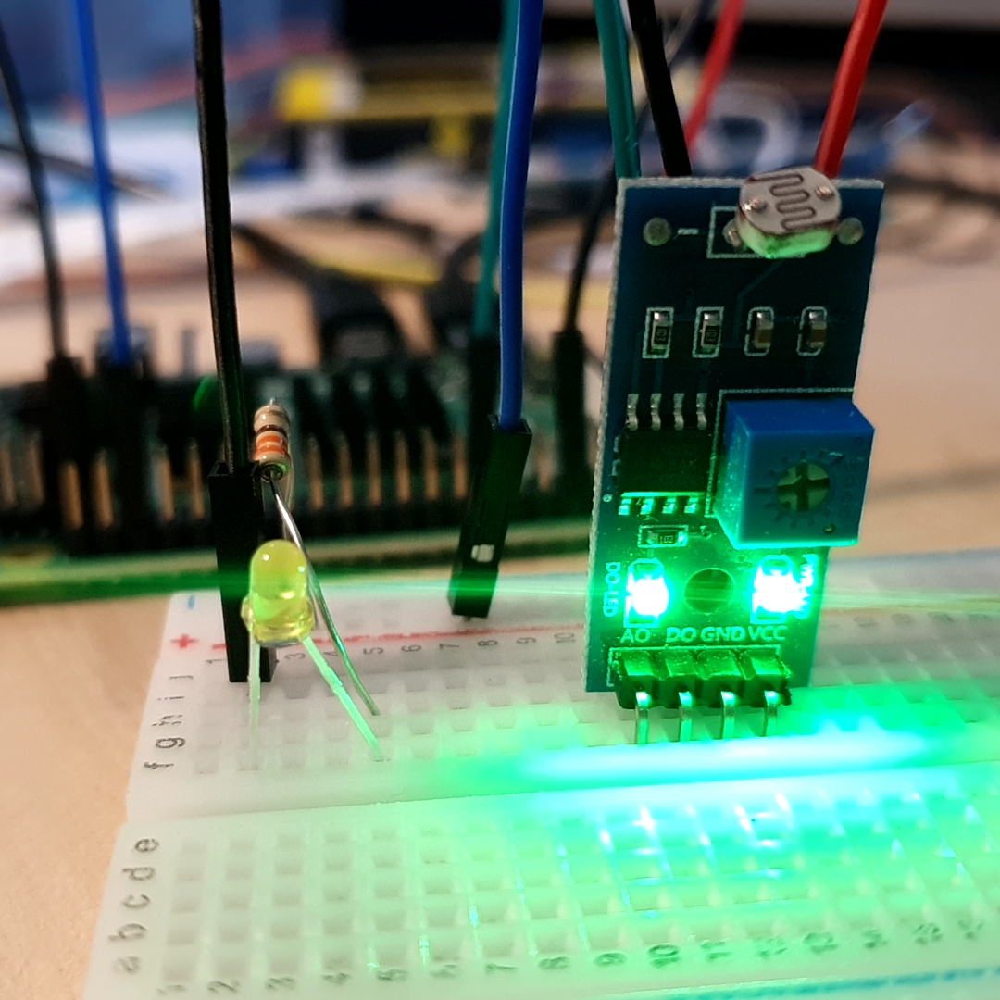
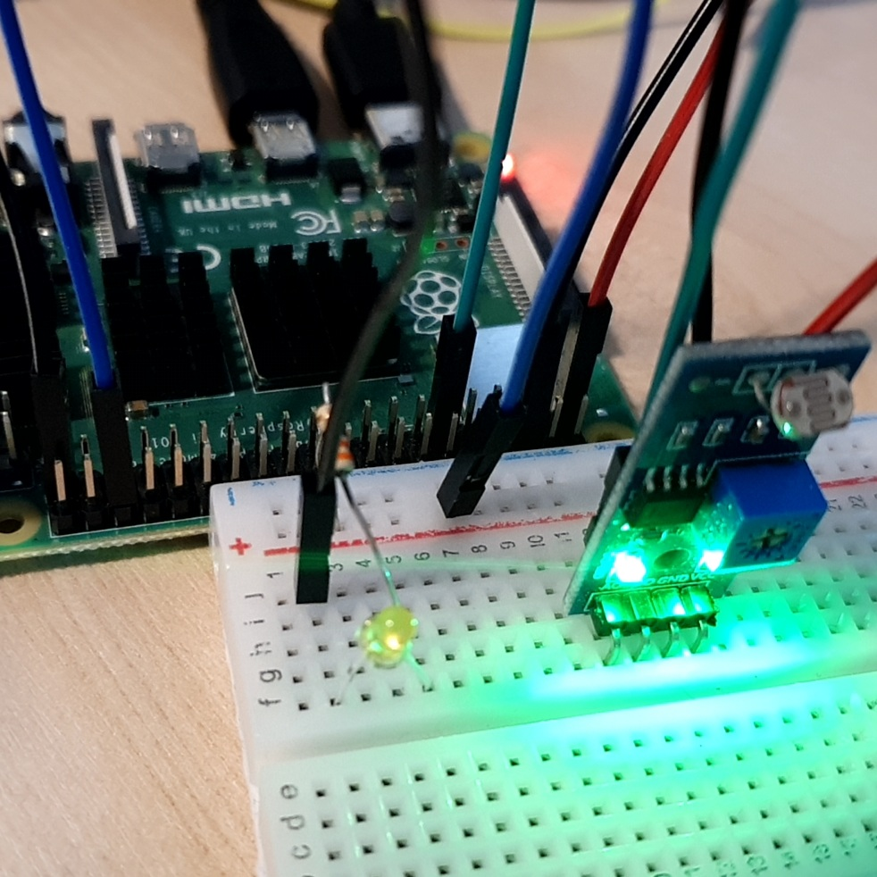
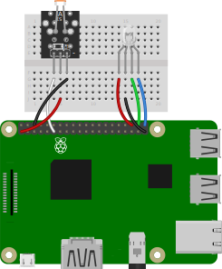
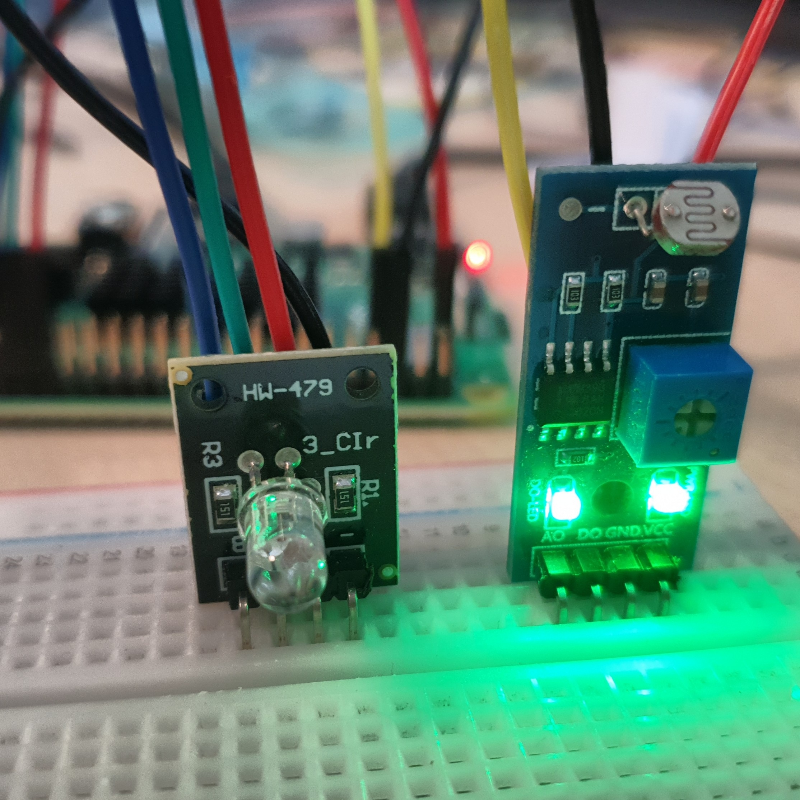
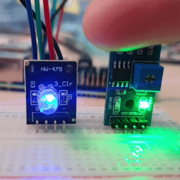

# 조도센서를 이용해 LED 가로등 만들기

조도센서와 LED를 이용해 주위의 빛을 감지한다. 

LED를 연결해 주위가 어두우면 켜지는 가로등을 만든다. 

RGBLED를 연결해 주위가 어두우면 서서히 밝아지는 조명을 만든다. 

<br>

### 준비물

+ 조도센서

+ LED

+ Resistor

+ RGBLED

<br>

### 결선도 1



<br>

### 결선방법1

조도센서의 전원을 3v3에 연결한다.

조도센서의 GND 핀을 Ground에 연결한다. 

조도센서의 신호(-)핀을 GPIO핀에 연결한다. 

LED의 음극을 GND에 연결한다. 

LED의 양극을 저항을 통해 GPIO핀으로 연결한다. 





<br>

### 예제코드 1

조도센서로 주변의 빛을 감지해 어두워지면 LED가 켜진다. 

```python
from gpiozero import LightSensor, LED
from signal import pause

sensor = LightSensor(17)
led = LED(16)

sensor.when_dark = led.on
sensor.when_light = led.off

pause()
```

<br>

### 결과 1


조도센서로 빛을 감지하여 주변의 상황에 맞게 불을 밝혀주는 가로등이 완성되었다. 

<br>

### 결선도 2



<br>

### 결선방법 2

조도센서의 전원을 3v3에 연결한다. 

조도센서의 GND 핀을 Ground에 연결한다. 

조도센서의 신호(-)핀을 GPIO핀에 연결한다. 

R, G, B 를 각각 GPIO 핀에 연결하고, GND 핀을 연결한다. 



<br>

### 예제코드 2

조도센서로 주변의 빛을 감지해 어두워지면 RGBLED가 서서히 밝아진다. 

```python
from gpiozero import LightSensor, LED
from signal import pause
from gpiozero import RGBLED
from time import sleep

sensor = LightSensor(4)
led = RGBLED(red=16, green=20, blue=21)

def lighton():
    for n in range(100):
        led.blue = n/100
        sleep(0.05)

sensor.when_dark = led.off
sensor.when_light = lighton

pause()
```

<br>

### 결과 2



조도센서로 빛을 감지하여 서서히 밝아지는 조명이 완성되었다. 