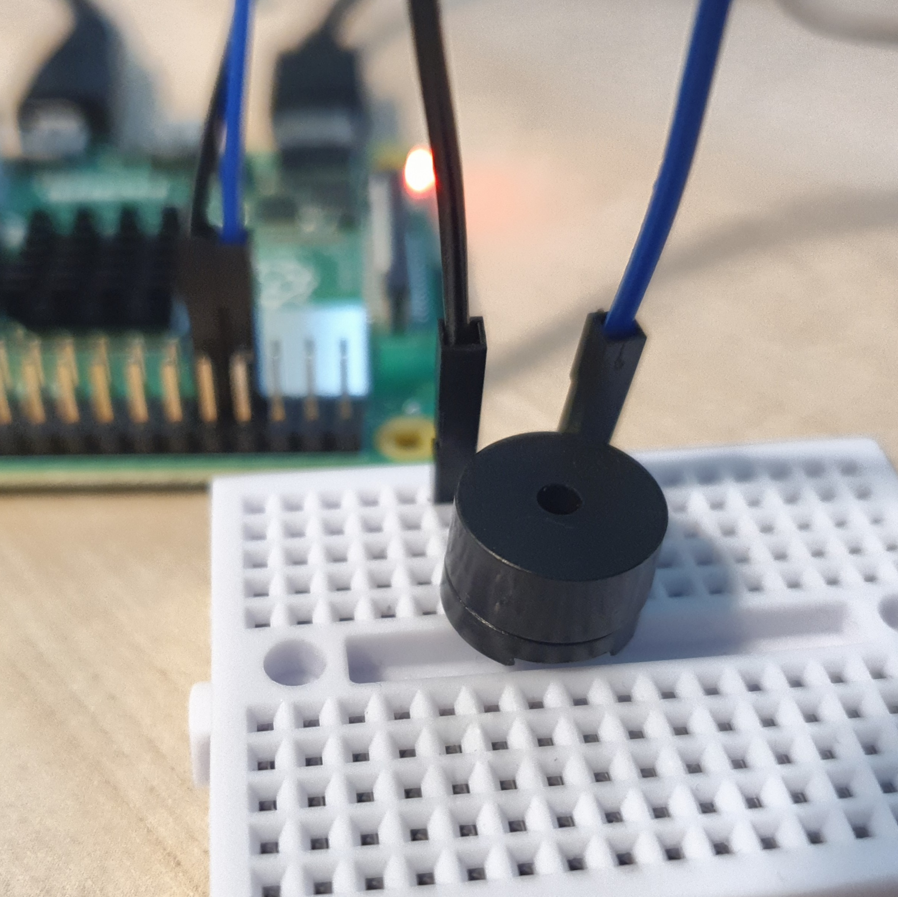

# 피에조버저 연결

피에조버저에 대해 알아보고 소리가 나는 원리를 배운다. 

피에조버저를 연결해 소리를 낸다. 

피에조버저를 제어하는 Buzzer 코드에 대해 알아보자. 

<br>

### 준비물


+ 피에조버저

    피에조버저란 피에조효과를 이용하여 소리를 내는 작은 스피커이다. 

    수정이나 세라믹 같은 결정체의 성질을 이용하여 압력을 주면 변형이 일어나 표면의 떨림을 이용해 소리를 출력한다. 

    <br>

    능동부저와 수동부저로 나뉜다. 

    + 능동부저 - 전기를 연결하면 '삐' 하는 경고음을 낸다. 

    + 수동부저 - 음계를 이용하여 멜로디를 출력한다. 주파수를 이용하여 원하는 음계의 소리를 낼 수 있다. 

<br>

### 결선도


<br>

### 결선방법

버저의 한 쪽을 GPIO핀에 연결한다. 

버저의 다른 한 쪽을 GND에 연결한다. 



<br>

### 예제코드 1

버저를 켠다. 

```python
from gpiozero import Buzzer

bz = Buzzer(4)
bz.on()
```

<br>

### 결과 1

버저가 울린다. 

<br>

### 예제코드 2

버저를 켰다 껐다 신호음을 만든다. 

```python
from gpiozero import Buzzer
from time import sleep

bz = Buzzer(4)

while True:
    bz.on()
    sleep(0.5)
    bz.off()
    sleep(1)
```

아래의 코드도 위와 같은 결과를 가져온다. 

```python
from gpiozero import Buzzer
from time import sleep

bz = Buzzer(4)

while True:
    bz.beep()
```

<br>

### 결과 2

1초에 한 번씩 연결 된 버저에서 신호음이 울린다. 

<br>

### 코드설명

#### Buzzer

```
classgpiozero.Buzzer(pin, active_high=True, initial_value=False)
```

부저의 음극을 GND 핀에 연결하고, 다른 한 쪽을 GPIO 핀에 연결한다. 

Parameters:

+ pin (int or str)

    부저가 연결된 핀. 

+ active_high (bool)

    True(default) - 버저의 음극을 GND에 연결하고 양극을 저항을 통해 GPIO 핀에 연결 하는 경우. 
    
    False - 버저의 음극을 GPIO 핀에 연결하고 양극을 3V3 핀에 연결하는 경우. 

+ initial_value (bool or None) 

    False(default) - 버저거 처음에 꺼짐. 
    
    None - 버저가 인식 되었을 때의 상태로 유지. 
    
    True - 버저가 처음에 켜짐. 