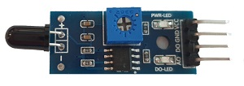
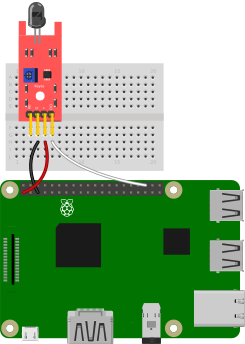
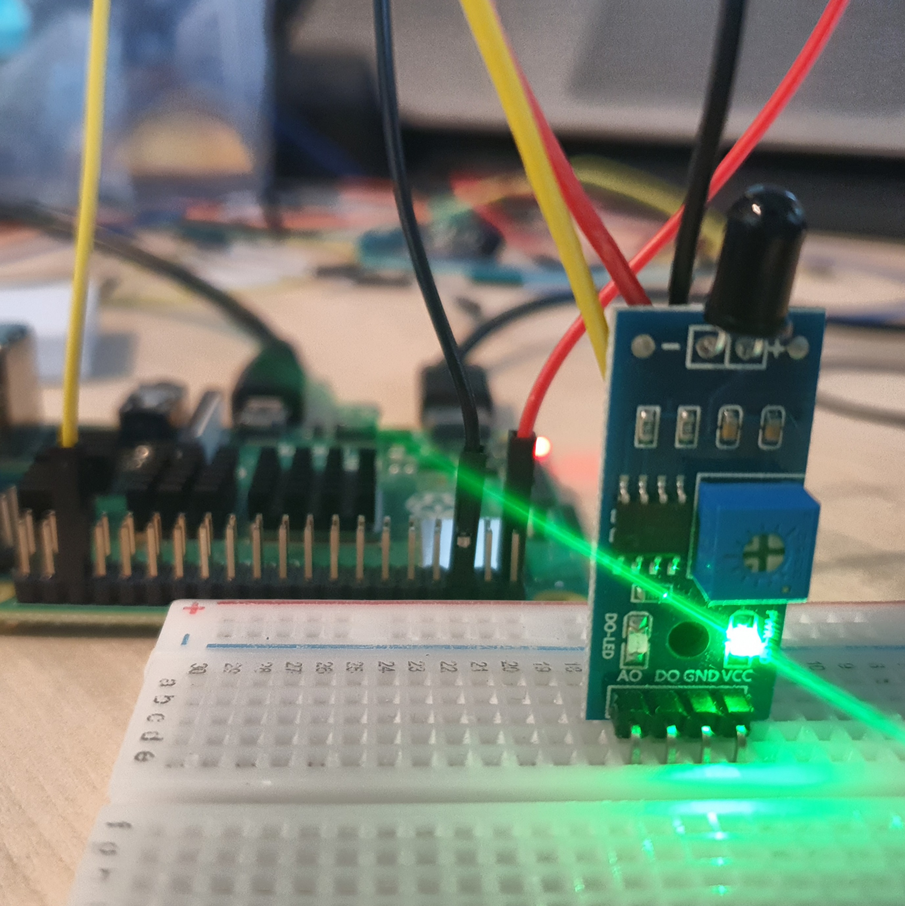

# 불꽃감지센서 연결

불꽃감지센서의 원리에 대해 알아본다. 

불꽃감지센서를 연결해 주위의 불꽃을 감지하여 출력하는 장치를 만든다. 

불꽃감시센서를 제어하는 코드에 대해 알아본다. 

<br>

### 준비물



+ 불꽃감지센서
    
    불꽃 감지 센서란 적외선 LED를 통해 화재 시 연소 반응에 의해 불꽃에서 파생되는 열 복사인 적외선 파장 (760nm ~ 1100nm)을 감지하여 아날로그 혹은 디지털 신호로 변환해 주는 센서이다. 

    감도 조절이 가능하고, 60도의 검출각으로 민감한 불꽃 감지 스펙트럼을 가지고 있다. 

    최대 감지 거리는 약 17cm ~ 18cm 이다. 

    문화재 시설이나 주요 공공 시설에 화재 감지용을 사용되거나 , 산업용이나 민간용 제품의 고전압 릴레이 및 브러쉬 접전, 스위치에서 발생하는 스파크성 불꽃 감지 등 실생활에서 다양하게 응용할 수 있다. 

    작동 전압 : 3.3V ~ 5V

    <br>

    불꽃 감지 센서에는 4개의 핀이 있다. 

    + VCC
  
        전원을 연결하는 핀.

        3V3핀에 연결. 

    + GND

        Ground 핀으로 회로를 접지하는데 사용. 

        GND핀에 연결

    + DO 

        Digital Output의 약자로, 디지털 신호를 보낸다. 

        0 ~ 1023 사이의 값 전달. 

        GPIO핀에 연결. 

    + AO 
      
        Analog Output의 약자로, 아날로그 신호를 보낸다. 

      GPIO 핀에 연결. 

<br>

### 결선도



<br>

### 결선방법

전원을 3v3에 연결한다. 

GND 핀을 Ground에 연결한다. 

신호(-)핀을 GPIO핀에 연결한다. 



<br>

### 예제코드

불꽃감지기를 통해 1초에 한 번씩 불꽃이 감지되면 "Fire!" 메세지를 출력하고, 불꽃이 감지되지 않으면 "No Fire" 메세지를 출력한다. 

```python
from gpiozero import InputDevice
from time import sleep

sensor = InputDevice(16, pull_up = True)
# `pull_up = True`를 사용해 GPIO 기본값을 High로 설정

while True: 
    if sensor.is_active:
        print("Fire!")
        sleep(1)

    else:
        print("No Fire")
        sleep(1)

    # 1초에 한 번씩 불꽃을 감지해 상태를 출력
```

<br>

### 결과

```
No Fire
No Fire
Fire!
Fire!
No Fire
```

파일을 실행하면 불꽃감지기를 통해 주변의 불꽃을 감지하여 해당해는 메세지를 출력한다. 

<br>

### 코드 설명

#### InputDevice

```
classgpiozero.InputDevice(pin, pull_up=False, active_state=None)
```

일반적인 GPIO 입력 장치에 사용된다. 

Parameters:	

+ pin (int or str)

    장치가 연결 된 GPIO 핀. 

+ pull_up (bool or None)

    라즈베리파이에서 저항 없이 3.3V의 전압에 연결하면 0 과 1의 값이 아닌 허공에 뜬 '플로팅' 상태가 된다. 

    플로팅 상태에서는 입력 값이 불안정하고 수시로 변하면 입출력에 방해가 되고 부품이 오래 작동하게 된다. 

    여러 가지 전기적인 충격으로부터 회로를 보호하고, 설계한 의도대로 정확하게 작동하는 것을 보장하기 위해 Pull_up을 사용한다. 

    True - 아무것도 연결되지 않은 상태에서 핀의 값을 읽어오면 High.
    
    False (기본값) - 전류의 방향을 Grond로 진행되어 핀의 값은 Low.  

    None - 핀이 부동 상태가 됨.

+ active_state (bool or None) 

    True - 장치의 값이 HIGH 이면, 결과 값도 HIGH.
    
    False - 장치의 값이 HIGH 이면, 핀의 값은 LOW.