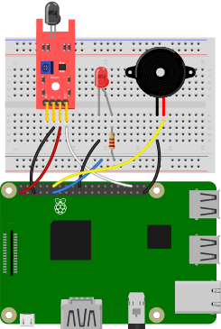
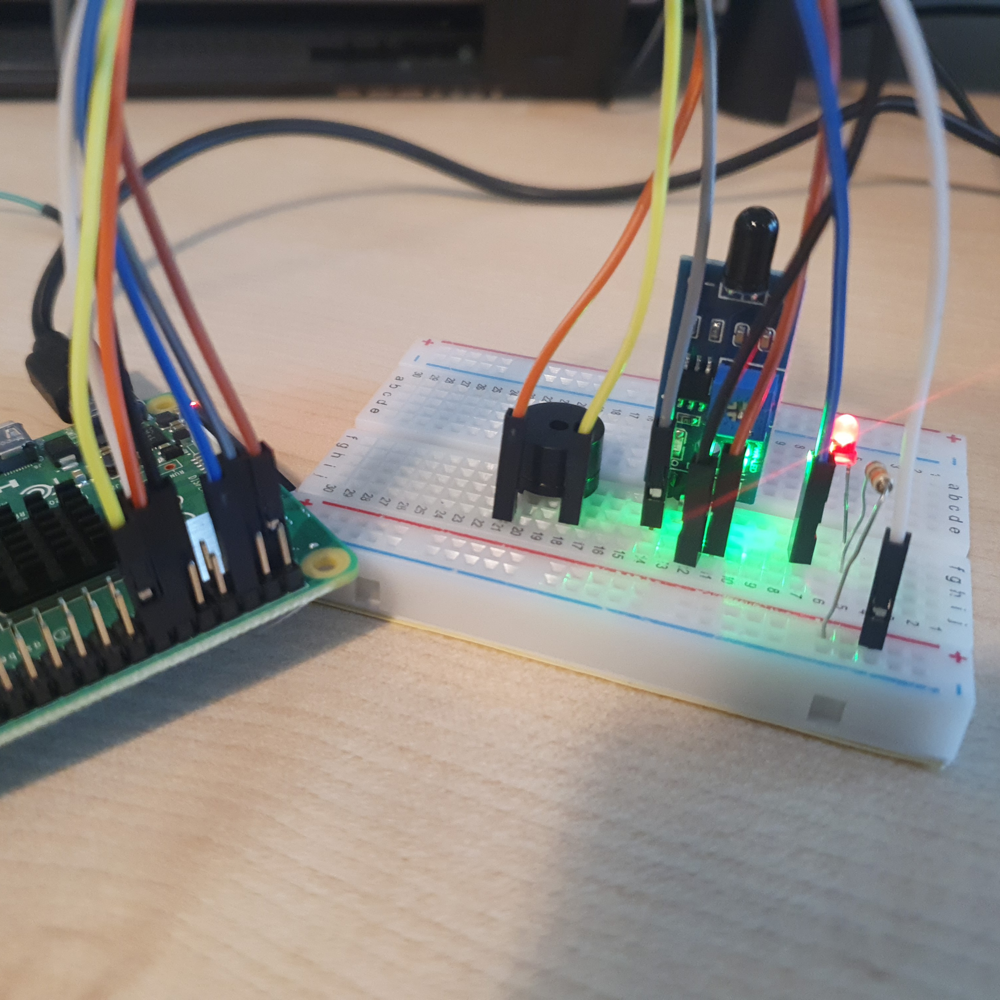

# 화재 경보기 

불꽃 감지기, LED, 버저를 활용해 불꽃이 감지되면 LED가 깜빡이고 버저가 울리는 화재경보기를 만든다. 

<br>

### 준비물

+ 버저

+ LED

+ Resistor

+ 불꽃감지기

<br>

### 결선도



<br>

### 결선방법

불꽃감지기의 전원을 3v3에 연결한다. 

불꽃감지기의 GND 핀을 Ground에 연결한다. 

불꽃감지기의 신호(-)핀을 GPIO핀에 연결한다. 

LED의 음극을 GND에 연결한다. 

LED의 양극을 저항을 통해 GPIO 핀으로 연결한다. 

버저의 한 쪽을 GPIO핀에 연결한다. 

버저의 다른 한 쪽을 GND에 연결한다. 



<br>

### 예제코드

불꽃감지기를 통해 주변의 불꽃이 감지되면 버저가 1초에 한 번씩 불리고 빨간 LED가 깜빡인다. 

```python
from gpiozero import InputDevice
from gpiozero import LED
from time import sleep

red = LED(17)
bz = Buzzer(18)
sensor = InputDevice(2, pull_up = True)

while True: 
    if sensor.is_active:
        print("Fire!")
        red.on()
        bz.beep()
        sleep(1)

    else:
        print("No Fire")
        red.off()
        bz.off()
        sleep(1)
```

<br>

### 결과 


불꽃이 감지되면 버저가 울리고 LED가 깜빡인다. 