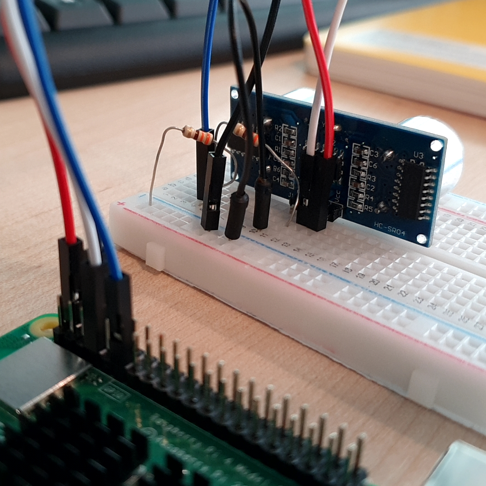

# 초음파센서로 거리 측정

초음파센서의 원리에 대해 알아본다. 

초음파센서를 연결하여 전방의 물체와의 거리를 측정한다. 

<br>

### 준비물


+ 초음파센서

    초음파센서는 약 20kHz 이상의 높은 수파수로 소리를 보낸 후 반사되어 돌아오는 시간차를 측정해 거리를 알아내는 '초음파 거리 측성 센서'이다. 

    전방으로 발사 된 초음파는 금속, 목제, 유리, 종이 등 단단한 물체는 100% 반사되어 돌아오지만 옷감과 같은 일부물질은 초음파를 흡수하기 때문에 측정값에 오류가 있다는 단점이 있다. 

    초음파센서의 왼쪽 동그란 TRIG에서 초음파를 내보내고, 오른쪽 동그라미 ECHO에서 반사되어 돌아오는 초음파를 인식한다. 

    자동차 후방 경보 시스템이 초음파를 이용하는 대표적이 예에 해당한다.

    <br> 

    + 측정범위 : 2cm ~ 4m
    
    + 측정 각도 : 15도

    + 사용 전압 : 5V

    + 사용 전류 : 15mA

    <br>

    HC-SR04 초음파센서에는 4개의 핀이 있다. 

    + VCC

        전원을 연결하는 핀. 

        5V에 연결. 

    + Trig

        Trigger의 줄일말로 초음파를 발사하는 핀이다. 

    + Echo

        발사한 초음파를 받는 핀으로 항상 HIGH로 있다가 초음파가 돌아오면 LOW 상태로 변한다. 

    + Gnd

        Ground에 연결. 

+ Resistor 330Ω, 470Ω

    정확한 값의 저항이 없을 경우 저항의 2 : 3 비율을 얼추 맞춘다면 정상적으로 작동한다. 

<br>

### 결선도


<br>

### 결선방법

VCC핀은 5V에 연결한다. 

Trig핀은 GPIO핀에 연결한다. 

Echo핀은 저항을 통해 GPIO 핀으로 연결한다. 

GND핀은 저항과 Echo핀을 통해 Ground핀으로 연결한다. 



<br>

### 예제코드

초음파 센서로 거리를 감지해 그 값을 출력한다. 

```python
from gpiozero import DistanceSensor
from time import sleep

sensor = DistanceSensor(echo=17, trigger=4)

while True:
    print(sensor.distance, 'm')
    sleep(1)
    # 1초에 한 번씩 센서와 물체와의 거리를 감지해 출력한다. 
```

<br>

### 결과

```
1.0 m
0.09424512233670612 m
0.08388244620636215 m
0.08036368800765559 m
0.07981687483485075 m
```

위와 같이 초음파센서로 측정한 거리가 출력된다. 