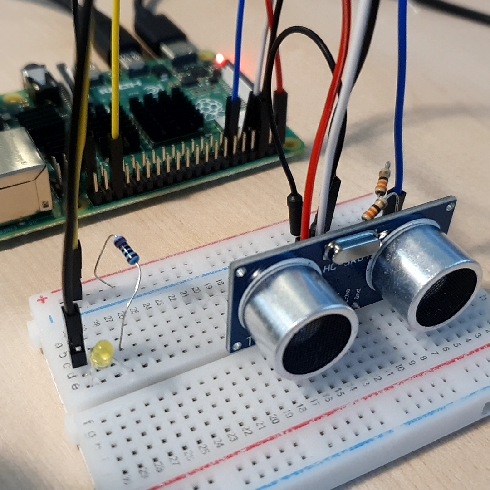

# 거리에 따라 반응하는 LED

초음파 센서의 거리 값을 이용하여 물체가 가까워 지면 불이 켜지고 멀어지면 꺼지는 물체 감지 장치를 만들어보자. 

초음파센서를 제어하는 DistanceSenso 코드에 대해 알아보자. 

<br>

### 준비물

+ 초음파센서

+ LED

+ Resistor 330Ω, 470Ω

<br>

### 결선도


<br>

### 결선방법

초음파센서의 VCC핀은 5V에 연결한다. 

초음파센서의 Trig핀은 GPIO핀에 연결한다. 

초음파센서의 Echo핀은 330Ω 저항을 통해 GPIO 핀으로 연결한다. 

초음파센서의 GND핀은 470Ω 저항과 Echo핀을 통해 Ground핀으로 연결한다. 

LED의 음극은 Ground로 연결한다. 

LED의 양극은 저항을 통해 GPIO 핀에 연결한다.




<br>

### 예제코드

초음파센서로 거리를 측정헤 다가오는 물체의 거리가 0.2m보다 가까우면 노란색 LED가 켜지고, 멀어지면 LED의 빛이 꺼진다. 

```python
from gpiozero import DistanceSensor, LED
from signal import pause

sensor = DistanceSensor(17, 4, max_distance=1, threshold_distance=0.2)
led = LED(16)

sensor.when_in_range = led.on
# 물체가 센서의 범위 안에 들어오면 불을 켠다. 
sensor.when_out_of_range = led.off
# 물체가 센서의 범위 밖으로 나가면 불을 끈다. 

pause()
```

<br>

### 결과 


물체가 초음파센서의 감지 거리 안에 다가가면 LED가 켜지고 감지 범위 밖으로 나가면 LED가 꺼진다. 

<br>

### 코드설명

#### DistanceSensor (HC-SR04)

```
gpiozero.DistanceSensor(echo, trigger, queue_len=30, max_distance=1, threshold_distance=0.3, partial=False)
```

Parameters : 

+ echo (int or str)

    ECHO 핀이 연결 된 GPIO 핀. 


+ trigger (int or str)

    TRIG 핀이 연결된 GPIO 핀. 

+ queue_len (int)

    센서에서 읽은 값을 저장하는 데 사용되는 대기열의 길이.

    기본값은 9. 

+ max_distance (float)

    측정 거리가 너무 가까울 경우 1을, 너무 멀어서 측정이 불가능 할 경우 1의 값을 반환. 

    기본값은 1. 

+ threshold_distance (float)

   값을 지나칠 때마다 in_range, out_of_range 이벤트를 실행. 

    기본값은 0.3m.

+ partial (bool)

    False (기본값) - 내부 대기열에 값이 다 채워 진 후 반환. 
    
    True - 값이 측정 직후에 바로 필요한 경우에만 설정. 

<br>

#### wait_for_in_range 

초음파센가 비활성화 되거나 시간 초과에 도달할 때 까지 스크립트를 일시 중지.

```
wait_for_in_range(timeout=None)
```

Parameters : 

+ timeout (float or None) 

    대기 시간. None(기본값)이면 무기한 대기. 

<br>

#### wait_for_out_of_range 

초음파센서가 활성화 되거나 시간 초과에 도달할 때 까지 스크립트를 일시 중지. 

```
wait_for_out_of_range(timeout=None)
```

Parameters : 

+ timeout (float or None) 

    대기 시간. None(기본값)이면 무기한 대기. 


<br>

#### distance

센서가 측정 한 현재 거리를 미터 단위로 변환. 