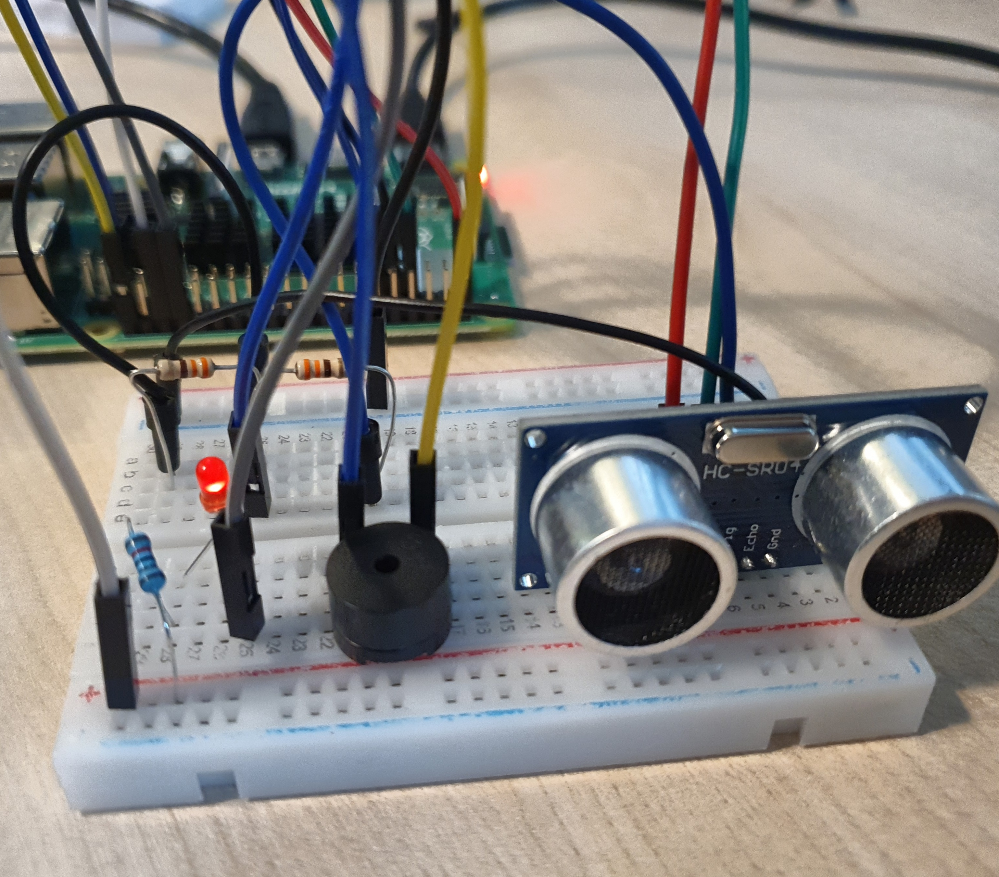

# 충돌 안내 LED

초음파센서와 LED를 이용하여 가까워지면 LED가 깜빡이고 버저가 울리는 충돌 경고 장치를 만들어보자. 

<br>

### 준비물

+ LED

+ Resistor

+ Buzzer 

+ 초음파센서

<br>

### 결선도


<br>

### 결선방법

초음파센서의 VCC핀은 5V에 연결. 

초음파센서의 rig핀은 GPIO핀에 연결한다. 

초음파센서의 Echo핀은 저항을 통해 GPIO 핀으로 연결한다. 

초음파센서의 GND핀은 저항과 Echo핀을 통해 Ground핀으로 연결한다. 

LED의 음극은 Ground로 연결한다. 

LED의 양극은 저항을 통해 GPIO 핀에 연결한다.

버저의 한 쪽을 GPIO핀에 연결한다. 

버저의 다른 한 쪽을 GND에 연결한다. 



<br>

### 예제코드

초음파센서로 거리를 감지해 물체가 센서의 거리가 0.2m 이하이면 LED가 깜빡이면서 버저를 통해 신호음이 난다. 

```python
from gpiozero import DistanceSensor, LED
from signal import pause
from gpiozero import Buzzer
from time import sleep

sensor = DistanceSensor(echo=17, trigger=4)
led = LED(16)
bz = Buzzer(21)

while True: 
    if sensor.distance < 0.2 :
        print("Caution")
        led.on()
        bz.on()
        sleep(0.5)
        led.off()
        bz.off()
        sleep(0.5)
        # 거리가 0.2m 이하이면 LED가 깜빡이고, 버저가 울린다. 

    else :
        print("all clear")
        led.off()
        bz.off()
        sleep(1)
        # 거리가 0.2 이하가 아니면 이상이 없다는 안내 문구와 함께 LED와 버저가 꺼진다. 
```

<br>

### 결과


물체가 센서와 가까워지면 LED가 깜빡이면서 버저를 통해 신호음이 난다. 
