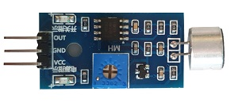
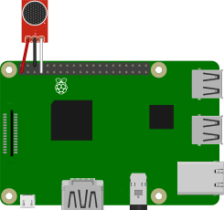
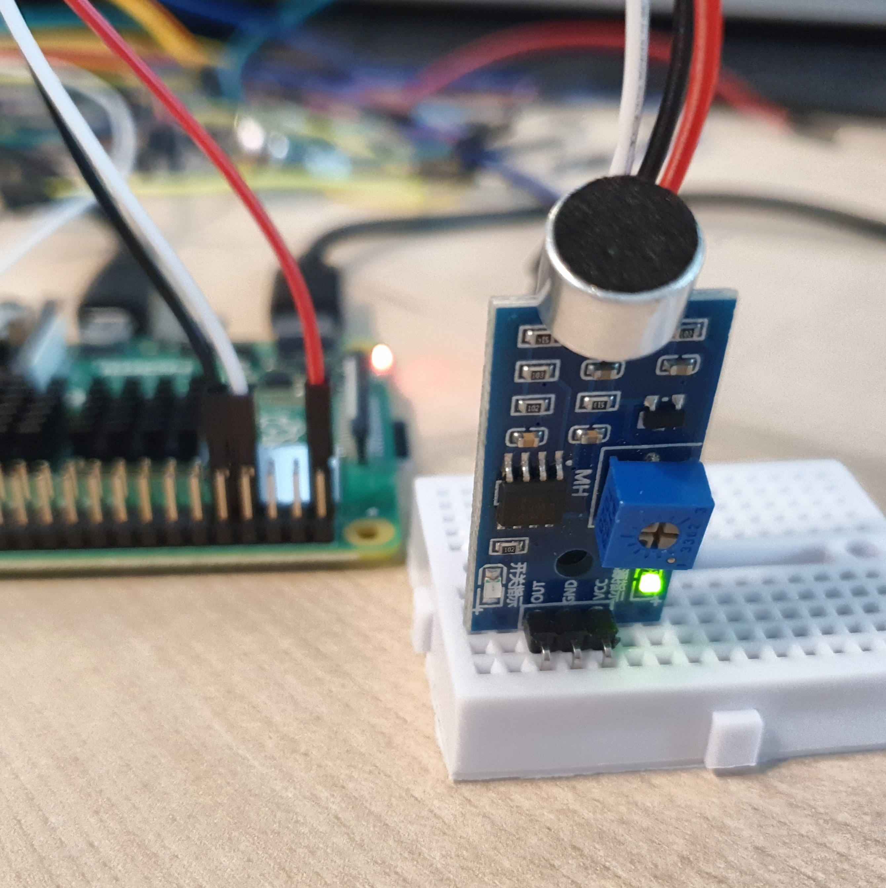
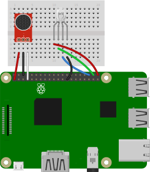
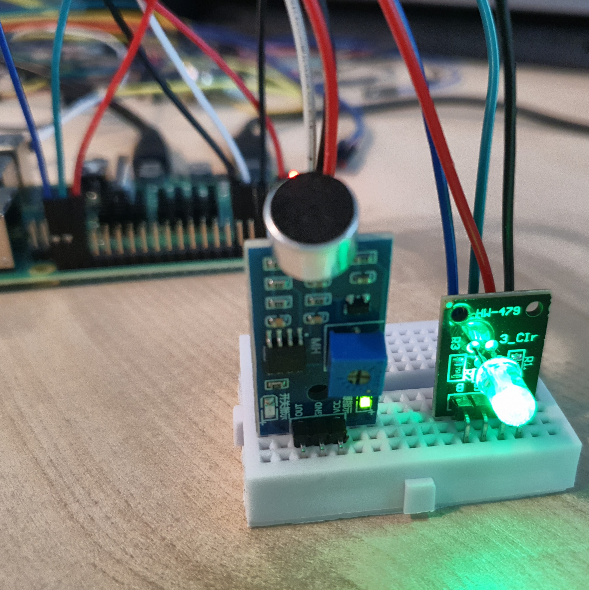
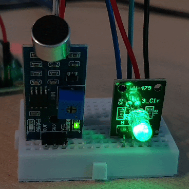

# 소음에 반응하는 LED

소음 감지 센서의 원리를 알아보자. 

소음 감지 센서로 주위의 소음을 감지하여 결과를 텍스트로 출력하는 장지를 만들어보자. 

소음 감지 센서와 RGBLED를 연결하여 주면의 소음에 따라 색이 바뀌는 LED 장치를 만들어보자.  

<br>

### 준비물



+ 소리 감지 센서

    소리 감지 센서 모듈에는 소리에 매우 민감한 정전식 용량형 일렉트릿 마이크로폰이 내장되어있다. 

    소리 감지 센서는 주변에 소음 여부 감지만 가능하다. 주파수나 볼륨을 인식하지는 못한다.

    <br>

    + 작동 전압 : 3.3V ~ 5V

    + 주파수 응답 : 50H ~ 20kHz

    <br>

    소리 감지 센서에는 3개의 핀이 있다. 

    + OUT

        결과 신호를 출력하는 핀. 

        0 또는 1의 값 출력. 

    + GND

        Ground 연결.

    + VCC

        3.3V ~ 5V 전원 연결 핀. 


+ LED

+ Resistor

+ RGBLED

<br>

### 결선도 1



<br>

### 결선방법 1

VCC핀을 3V3에 연결한다. 

GND핀을 Ground에 연결한다.

OUT핀을 GPIO에 연결한다. 



<br>

### 예제코드 1

주변의 소음을 측정해서 조용하면 "Quiet"를 소음이 감지되면 "Noisy"라는 텍스트를 출력한다. 

```python
from gpiozero import InputDevice
from time import sleep

sensor = InputDevice(4, pull_up = True)

while True: 
    if sensor.value == 1:
        print("Noisy")
        sleep(1)

    else:
        print("Quiet")
        sleep(1)
```

<br>

### 결과 1

```
Quiet
Noisy
Noisy
Quiet
Noisy
Quiet
```

1초에 한 번씩 소음을 감지하여 결과가 출력된다. 

<br>

### 결선도 2



<br>

### 결선방법 2

소리 감지 센서의 VCC핀을 3V3에 연결한다. 

소리 감지 센서의 GND핀을 Ground에 연결한다.

소리 감지 센서의 OUT핀을 GPIO에 연결한다. 

RGBLED의 R, G, B 핀을 각각 GPIO 핀에 연결하고, GND 핀을 연결한다. 



<br>

### 에제코드 2

LED를 연결해 주변의 소음이 감지되면 빨간불이 켜지고 조용하면 초록불이 켜진다. 

```python
from gpiozero import InputDevice
from time import sleep
from gpiozero import RGBLED

sensor = InputDevice(4, pull_up = True)

led = RGBLED(red=16, green=20, blue=21)

while True: 
    if sensor.value == 1:
        print("Noisy")
        led.color = (1, 0, 0)
        sleep(1)

    else:
        print("Quiet")
        led.color = (0, 1, 0)
        sleep(1)

```

<br>

### 결과 2



소음이 감지되면 빨간색으로 소음 없이 조용하면 초록색 빛을 낸다. 