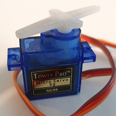
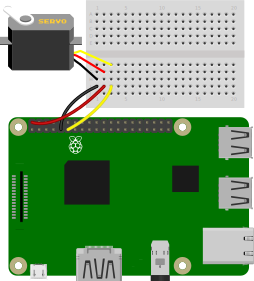
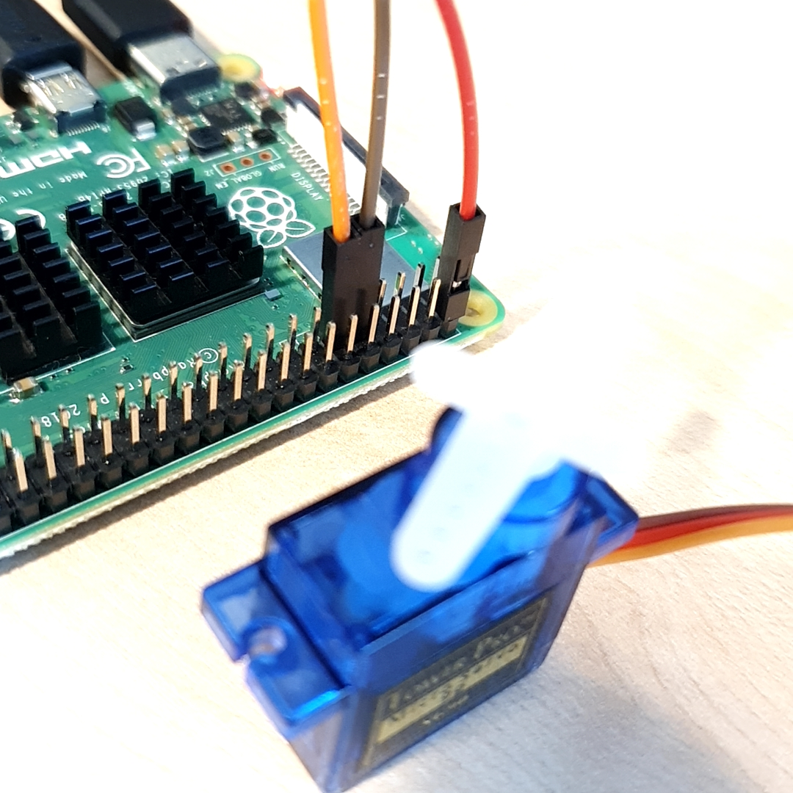

# 서보모터 연결

서보모터의 원리에 대해 알아본다. 

서보모터를 연결하여 제어한다. 

서보모터의 각도를 제어하는 AngularServo 코드에 대해 알아본다. 

<br>

### 준비물




+ 서보모터

    서보모터는 펄스 폭 변조 PWM (Pulse Width Modulation)에 따른 제어 방식으로 신호에 따라 정의 된 특정 각도로 회전한다. 

    PWM 방식은 일정한 주기 동안 On/Off를 반복하며 그 시간을 조절하여 원하는 출력을 제어하는 방식이다. 

<br>

### 결선도



<br>

### 결선방법

서보모터의 빨간 핀을 GPIO 5V에 연결한다. 

서보모터의 갈색선을 Groud에 연결한다. 

서보모터의 오렌지색선을 GPIO에 연결한다. 



<br>

### 예제코드 1

AngularServo를 이용하여 서보모터를 정교한 각도로 회전시킨다. 

```python
from gpiozero import AngularServo
from time import sleep

servo = AngularServo(17, min_angle=-90, max_angle=90)

while True:
    servo.angle = -90
    sleep(2)
    servo.angle = -45
    sleep(2)
    servo.angle = 0
    sleep(2)
    servo.angle = 45
    sleep(2)
    servo.angle = 90
    sleep(2)
```

<br>

### 결과 1


모터가 -90도, -45도, 0도, 45도, 90도 순서로 돌아간다.

<br>

### 코드설명

#### AngularServo

```
classgpiozero.AngularServo(pin, *, initial_angle=0, min_angle=-90, max_angle=90, min_pulse_width=1/1000, max_pulse_width=2/1000, frame_width=20/1000)
```

Parameters:	

+ pin (int or str) 

    서보모터가 연결된 핀. 

+ initial_angle (float)

    서보모터의 초기 지정 값으로 기본값은 0이다. 

    min_angle과 max_angle 사이에 있어야 한다.

+ min_angle (float) 

    서보모터가 회전할 수 있는 최소 각도. 

    기본값은 -90.

+ max_angle (float)

    서보모터가 회전할 수 있는 최대 각도. 

    기본값은 90.

+ min_pulse_width (float)

    서보모터의 최소 위치에 해당하는 펄스 폭. 

    기본값은 1ms. 

+ max_pulse_width (float)

    서보모터의 최대 위치에 해당하는 펄스 폭. 

    기본값은 2ms. 

+ frame_width (float)

    초 단위로 측정 된 서보모터 제어 펄스 사이의 시간.
    
    일반적으로 20ms로 설정.

<br>

#### max()/mid()/min()

서보를 최대/중간/최소 위치로 설정. 


<br>

#### angle

서보모터의 각도. 

min_angle과 max_angle이 제대로 설정 된 경우 값이 정확하다. 