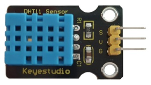
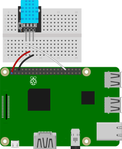
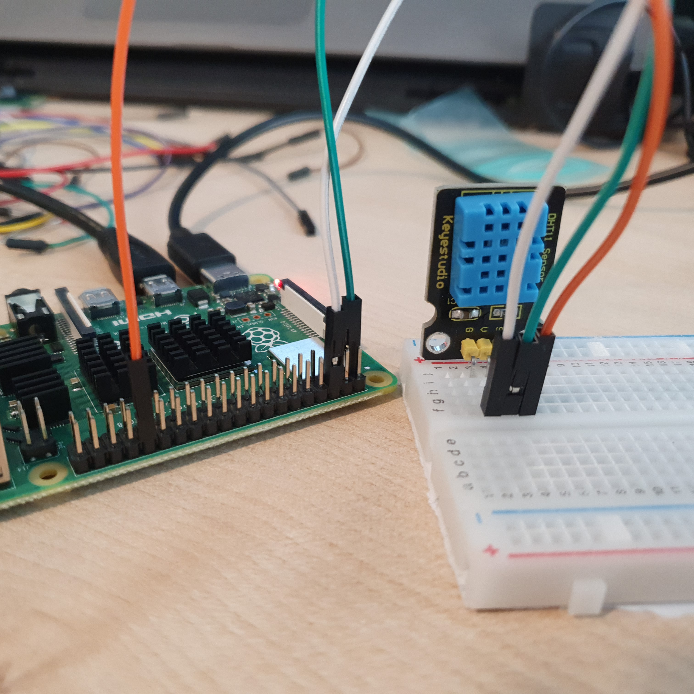

# 온습도센서 연결

온습도센서의 원리에 대해 알아보자.

온습도센서를 연결해 1초에 한 번씩 주위의 온도와 습도를 측정해 그 결과를 출력한다. 

<br>

### 준비물



+ 온습도센서

    온습도 센서란 정전식 습도 센서와 서미스터를 사용하여 대기온도를 측정하고 그 값을 출력하는 센서다. 

    정전식 습도 센서는 습도에 따라 변하는 저항 값으로 측정하고, 서미스터는 온도에 따라 저항 값이 변하는 소자다. 

    온도의 측정 범위는 0°C ~ 50°C (오차범위 2°C), 습도 측정 범위는 20% ~ 90%RH이다. 

    공기청정기, 에어컨 등에 사용된다. 

<br>

### 결선도



<br>

### 결선방법

V핀을 3v3에 연결한다. 

G핀을 Ground에 연결한다. 

S핀을 GPIO핀에 연결한다. 



<br>

### 예제코드

온습도 센서를 이용해 1초에 한 번씩 주변의 온도와 습도를 출력한다. 

```python
import time
import board
import adafruit_dht

dhtDevice = adafruit_dht.DHT11(board.D12)

while True:
    try:  
        temperature_c = dhtDevice.temperature
        temperature_f = temperature_c * (9 / 5) + 32
        humidity = dhtDevice.humidity
        print(
            "Temp: {:.1f} F / {:.1f} C    Humidity: {}% ".format(
                temperature_f, temperature_c, humidity
            )
        )

    except RuntimeError as error:
        print(error.args[0])
        time.sleep(2.0)
        continue

    except Exception as error:
        dhtDevice.exit()
        raise error

    time.sleep(2.0)
```

<br>

### 결과

```
Temp: 86.0 F / 30.0 C    Humidity: 26%
Temp: 86.0 F / 30.0 C    Humidity: 23%
Temp: 86.0 F / 30.0 C    Humidity: 22%
Temp: 86.0 F / 30.0 C    Humidity: 21%
```

위와 같이 1초에 한번 씩 온습도 센서를 통해 측정 된 온도가 출력된다. 