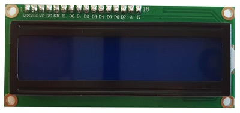

# CharLCD 라이브러리 설치

LCD에 대해 알아보자. 

LCD를 사용하기 위해 Charlcd 라이브러리를 설치한다. 

라이브러리를 호출하고 사용하는 방법에 대해 알아보자. 

<br>



LCD(Liquid Crystal)는 액정의 성질을 가지는 전류를 사용하여 신호값을 시각적으로 확인할 수 있는 액정 디스플레이이다. 

LCD가 표현 할 수 있는 글자수는 총 32글자로 16글짜 씩 2줄에 표시 할 수 있다. 

<br>

Adafruit Circuitpython Charlcd 라이브러리를 이용하여 16x2 LCD를 사용할 수 있다. 

Adafruit Circuitpython Charlcd를 사용하기 위해선 아래의 드라이버를 모두 설치해야 한다. 

또한, I2C & SPI 디스플레이 연결을 위한 설정도 필요하다. 

아래의 순서에 따라 설치 하자.

<br>

### 설치

circuitpython 라이브러리 설치 :

```
cd ~
sudo pip3 install --upgrade adafruit-python-shell
wget https://raw.githubusercontent.com/adafruit/Raspberry-Pi-Installer-Scripts/master/raspi-blinka.py
sudo python3 raspi-blinka.py
```

Adafruit CircuitPython BusDevice 설치 :


```
pip3 install adafruit-circuitpython-busdevice
```

Adafruit_CircuitPython_MCP230xx 설치 : 


```
pip3 install adafruit-circuitpython-mcp230xx
```

Adafruit_CircuitPython_74HC595 설치 : 

```
pip3 install adafruit-circuitpython-74hc595
```

I2C & SPI 설정 : 

```
ls /dev/i2c* /dev/spi*
dtoverlay=spi1-3cs
```

<br>

### 라이브러리 사용

라이브러리 호출 : 

```python
import board
import digitalio
import adafruit_character_lcd.character_lcd as character_lcd
```

데이터 핀 정의 : 

```python
lcd_rs = digitalio.DigitalInOut(board.D7)
lcd_en = digitalio.DigitalInOut(board.D8)
lcd_d7 = digitalio.DigitalInOut(board.D12)
lcd_d6 = digitalio.DigitalInOut(board.D11)
lcd_d5 = digitalio.DigitalInOut(board.D10)
lcd_d4 = digitalio.DigitalInOut(board.D9)
```

백라이트 on/off 설정 (따로 설정 하지 않으면 on) : 

```
lcd_backlight = digitalio.DigitalInOut(board.D13)
```

CharLCD의 크기 정의 : 

```python
lcd_columns = 16
lcd_rows = 2
```

LCD를 설정한 후 아래와 같이 호출 : 

```python
lcd = character_lcd.Character_LCD_Mono(lcd_rs, lcd_en, lcd_d4, lcd_d5, lcd_d6, lcd_d7, lcd_columns, lcd_rows, lcd_backlight)
```

아래의 메세지를 출력하여 핀이 올바르게 설정 되었는지 확인 : 

```python
LCD . message  =  "안녕하세요 \ n CircuitPython"
```

<br>

아래의 링크를 통해 라이브러리의 자세한 정보를 확인 할 수 있다. 

https://github.com/adafruit/Adafruit_CircuitPython_CharLCD