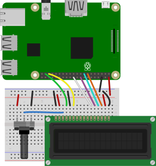
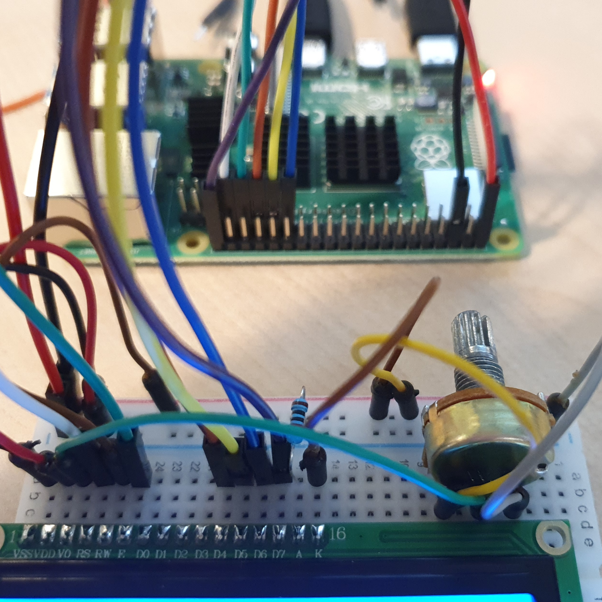
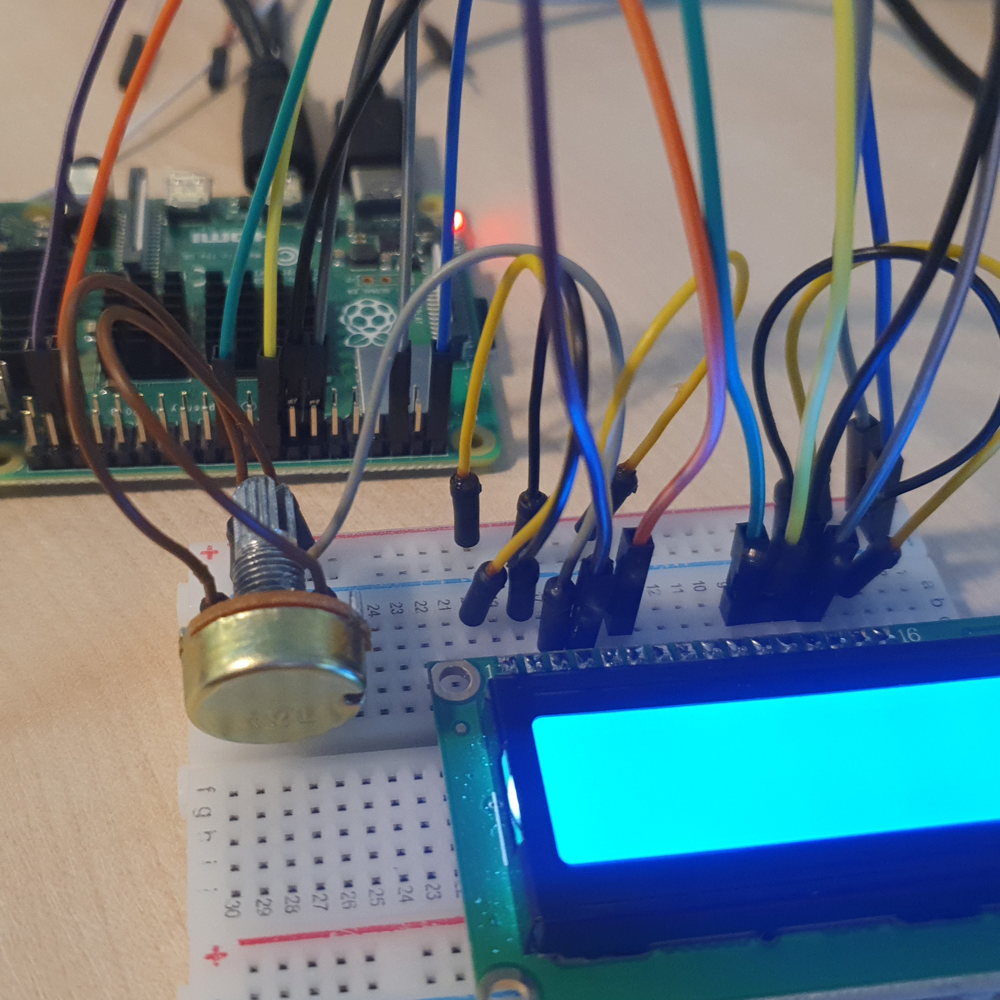
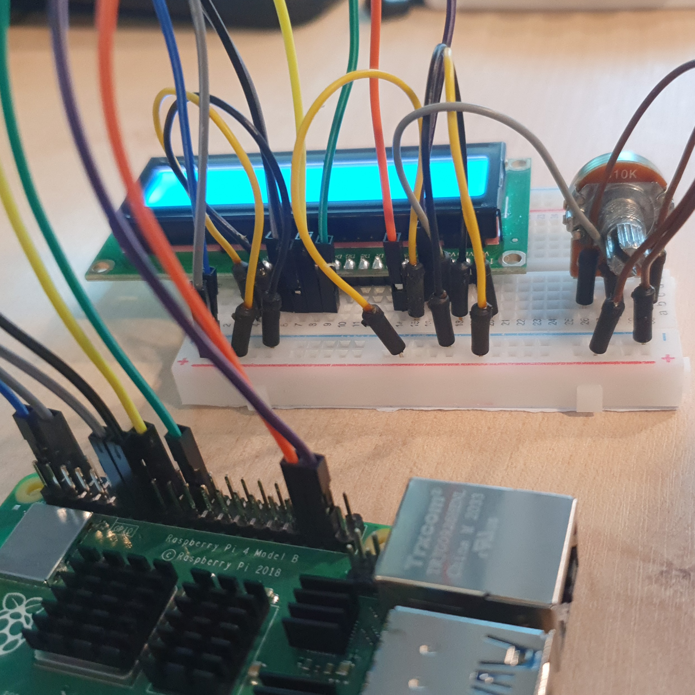
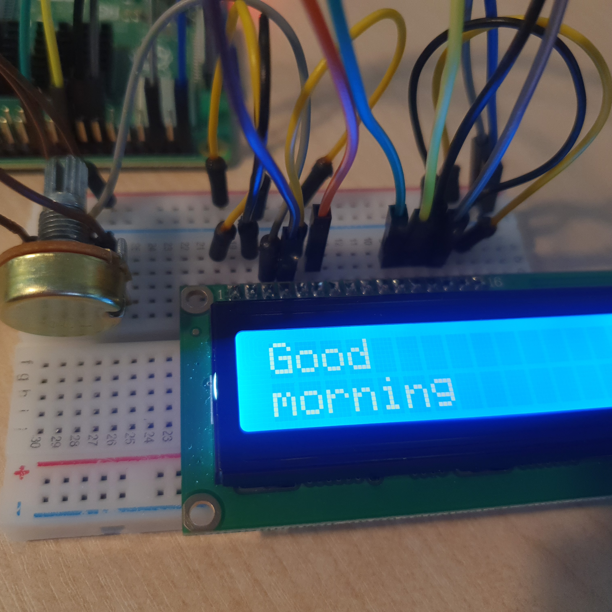

# LCD 연결

LCD의 16가지 핀의 역할에 대해 이해하고 사용법을 배운다. 

LCD를 연결해 메세지를 출력하는 장치를 만든다. 

<br>

### 준비물

+ LCD

    LCD에는 16개의 핀이 있다. 

    + VSS

        GND

    + VDD

        LCD 전원, 5V

    + VO

        LCD 밝기, 명암 제어.

        글자 대비값

        가변 저항을 통해 0 ~ 5V 사이 입력

    + RS

        Resister Select 레지스터 선택 핀. 

        데이터 레지스터(HIGH)를 선택하고 데이터 라인에 입력을 공급하면, LCD 화면에 표시할 데이터로 취급. 

        명령 레지스터(LOW)를 선택하고 데이터 라인에 입력을 공급하면, 명령 (커서 위치 지정, 화면 또는 스크롤 지우기 등)으로 처리. 

    + RW

        읽기, 쓰기 모드핀으로 읽기 쓰기 모드를 선택하는 데 사용. 

        HIGH는 읽기 모드를, LOW는 쓰기 모드를 활성화. 

        일반적으로 GND에 연결. 

    + E

        Enable 쓰기 모드 활성화. 

        데이터 전송 시작. 

    + D0 ~ D7

        데이터 입출력 신호 핀. 

        4비트 모드로 동작하는 경우 4개만 사용. 

    + A

        백라이트 LED +.  배경의 밝기 전압 입력. 

        3.3V에 연결하거나 5V 연결 시 저항을 사용. 


    + K

        백라이트 LED -. 배경의 밝기. 

        GND에 연결. 

+ 가변저항 (Potentiomete)

    가변저항은 저항의 크기를 바꿀 수 있는 저항으로, 음량을 조절하야 하는 스피커나, 밝기를 조절해야 하는 LED에 사용한다. 

<br>

### 결선도



<br>

### 결선방법

LCD의 VDD와 A핀은 저항의 한 쪽을 통해서 5V에 연결한다. 

LCD의 VSS, RW, K핀은 저항의 반대쪽을 통해 GND에 연결한다. 

LCD의 VO핀은 저항의 가운데 연결한다. 

LCD의 RS핀은 GPIO26핀에 연결한다. 

LCD의 E핀은 GPIO19핀에 연결한다. 

LCD의 D4핀은 GPIO25핀에 연결한다. 

LCD의 D5핀은 GPIO24핀에 연결한다. 

LCD의 D6핀은 GPIO22핀에 연결한다. 

LCD의 D7핀은 GPIO27핀에 연결한다. 





<br>

### 예제코드

LCD를 통해 원하는 메세지를 출력한다. 

```python
import board
import digitalio
import adafruit_character_lcd.character_lcd as characterlcd

lcd_rs = digitalio.DigitalInOut(board.D26)
lcd_en = digitalio.DigitalInOut(board.D19)
lcd_d7 = digitalio.DigitalInOut(board.D27)
lcd_d6 = digitalio.DigitalInOut(board.D22)
lcd_d5 = digitalio.DigitalInOut(board.D24)
lcd_d4 = digitalio.DigitalInOut(board.D25)

lcd_columns = 16
lcd_rows = 2

lcd = characterlcd.Character_LCD_Mono(lcd_rs, lcd_en, lcd_d4, lcd_d5, lcd_d6, lcd_d7, lcd_columns, lcd_rows)

lcd.message = "Good\nmorning"
```

<br>

### 결과



위와 같이 Good morning이라는 문구가 LCD를 통해 출력된다. 