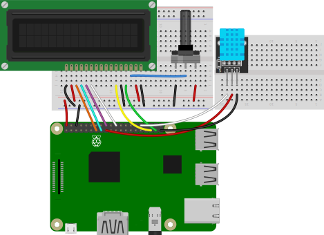
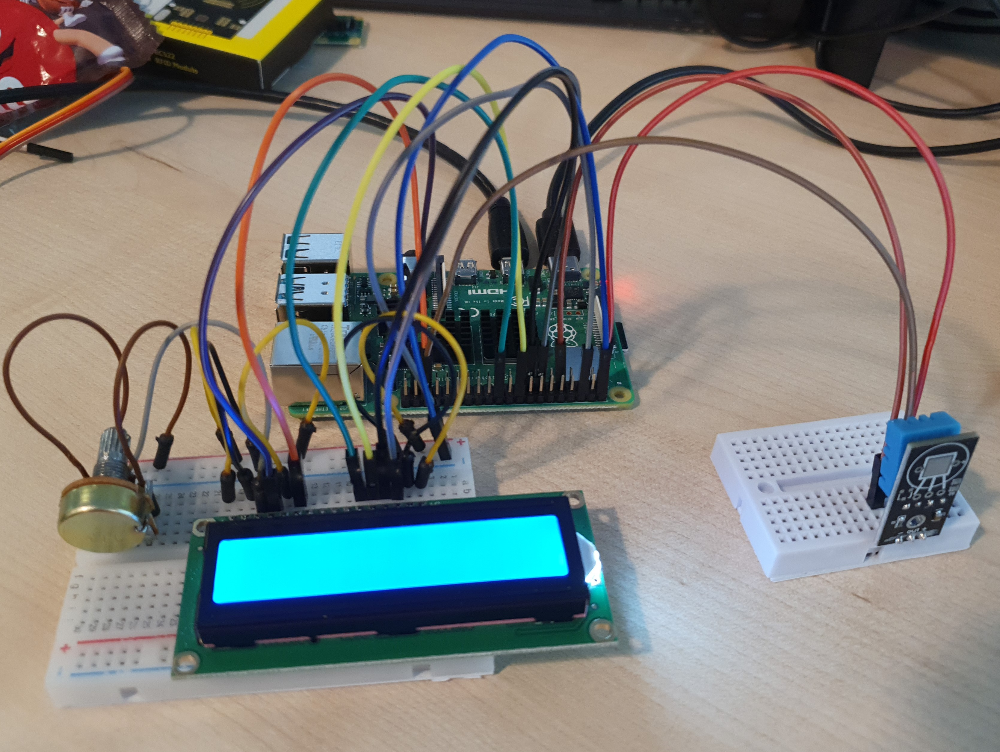
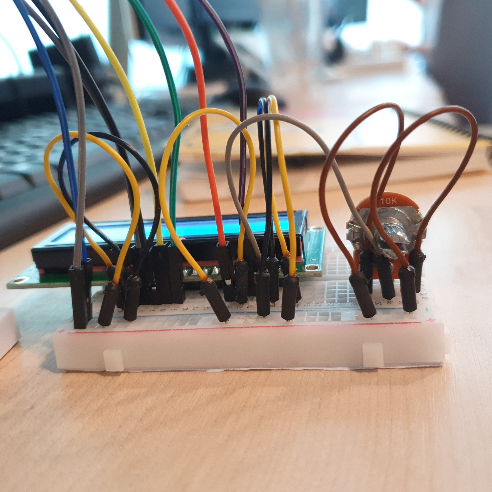
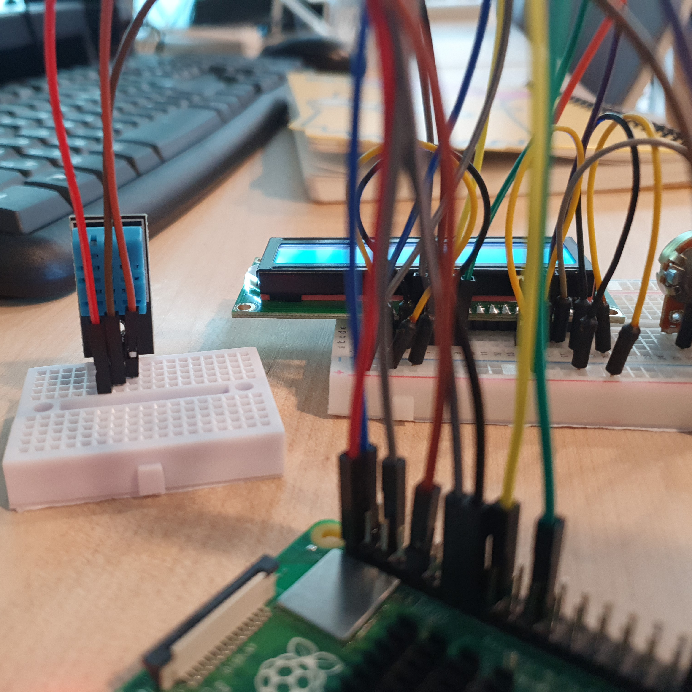
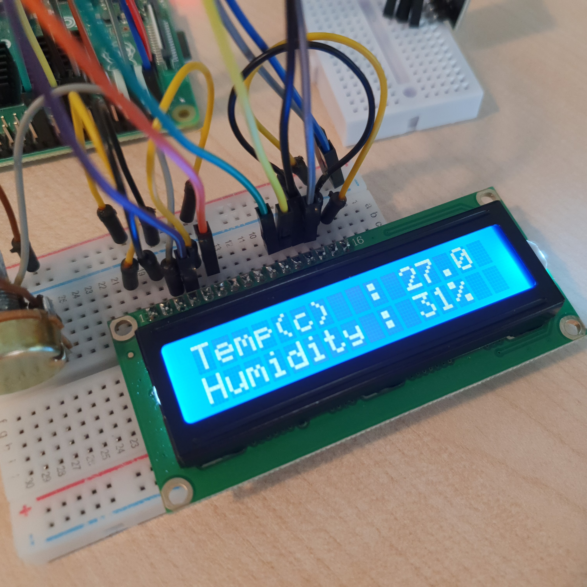

# Monitor temperature and Humidity

온습도센서를 연결해 주위의 온도와 습도를 측정한다. 

측정한 온도와 습도 값을 LCD를 통해 보여주는 장치를 만든다 

<br>

### 준비물

+ 온습도센서

+ LCD

<br>

### 결선도



<br>

### 결선방법

온습도센서의 V핀을 3v3에 연결한다. 

온습도센서의 G핀을 Ground에 연결한다. 

온습도센서의 S핀을 GPIO핀에 연결한다. 

LCD의 VDD와 A핀은 저항의 한 쪽을 통해서 5V에 연결한다. 

LCD의 VSS, RW, K핀은 저항의 반대쪽을 통해 GND에 연결한다. 

LCD의 VO핀은 저항의 가운데 연결한다. 

LCD의 RS핀은 GPIO26핀에 연결한다. 

LCD의 E핀은 GPIO19핀에 연결한다. 

LCD의 D4핀은 GPIO25핀에 연결한다. 

LCD의 D5핀은 GPIO24핀에 연결한다. 

LCD의 D6핀은 GPIO22핀에 연결한다. 

LCD의 D7핀은 GPIO27핀에 연결한다. 








<br>

### 예제코드 

온습도 센서를 이용해 측정한 값을 LCD에 출력한다. 

```python
import board
import digitalio
import time
import adafruit_dht
import adafruit_character_lcd.character_lcd as characterlcd

dhtDevice = adafruit_dht.DHT11(board.D21)

lcd_rs = digitalio.DigitalInOut(board.D26)
lcd_en = digitalio.DigitalInOut(board.D19)
lcd_d7 = digitalio.DigitalInOut(board.D27)
lcd_d6 = digitalio.DigitalInOut(board.D22)
lcd_d5 = digitalio.DigitalInOut(board.D24)
lcd_d4 = digitalio.DigitalInOut(board.D25)

lcd_columns = 16
lcd_rows = 2

lcd = characterlcd.Character_LCD_Mono(lcd_rs, lcd_en, lcd_d4, lcd_d5, lcd_d6, lcd_d7, lcd_columns, lcd_rows)

temperature_c = dhtDevice.temperature
humidity = dhtDevice.humidity

lcd.message = "Temp(c)  : {:.1f}\nHumidity : {}% ".format(temperature_c, humidity)
```

<br>

### 결과



코드를 실행하면 온습도센서를 통해 온도와 습도를 측정한 후 LCD에 위와 같이 출력된다. 