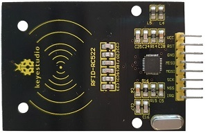

# RFID 설치

RFID에 대해 알아보고 RFID의 8개 핀의 역할과 사용법에 대해 배운다. 

RFID 사용을 위한 설치를 한다. 

<br>

RFID는 무선 주파수 식별(radio frequency identification)의 줄인말로, 주파수를 이용해 ID를 식별하는 전자태그이다. 작동 원리는 다음과 같다. 

RFID 태그에 목적에 맞는 정보를 입력한 후 상품에 접촉하면, 리더에서 안테나를 통해 발사된 무선주파수 태그에 접촉한다. RFID 태그의 직접 회로 안에 기록된 정보를 안테나로 전송하고, 안테나는 전송 받은 데이터를 디지털신호로 변조하여 리더에 전달한다. 리더는 데이터를 해독하여 컴퓨터 등으로 전달한다. 

바코드와 유사한 기능을 하지만 바코드처럼 짧은 거리에서만 작동하지 않고 먼 거리에서도 태그를 읽을 수 있으며, 바코드의 대체품으로서 더 다양한 정보를 수록할 수 있다. 심지어 물체를 통과해서 정보를 수신 할 수 있다. 

RFID는 주파수로 구분하는데 120KHz 부터 956MHz까지 넓은 범위로 이용 가능하지만, 국제적으로 RFID 호환성을 보장하기 위해 몇 몇 종류의 대표적인 RFID를 13.56MHz로 국제 표준을 제정하였다. 

RFID 기술은 그 활용도가 무궁무진하다. 고속도로의 하이패스, 교통카드, 물류 관리 시스템 뿐만 아니라 동물이나 사람의 몸에 이식해 개인정보와 ID 식별을 위해 사용되기도 한다. 

RFID는 반영구적 사용이 가능하고 반복 재사용이 가능하고, 다수의 태그와 라벨의 정보를 동시에 인식이 가능해 보다 신속한 처리가 가능하다. 하지만 개인 프라이버시 침해와 해킹 등 보안이 취약하다는 단점이 있어 사용에 주의해야 한다. 

<br>

### RFID RC522 모델



RFID RC522는 MFRC522 마이크로 컨트롤러를 기반으로 하는 매우 저렴한 무선 주파수 식별기 이다.

3.3V에서 동작하고, 인식거리는 10cm이며, 13.56MHz의 주파수를 사용하며 작동한다. 

<br>

RC522에는 8개의 핀이 있다. 

+ VCC

    전원 연결 핀. 3V3핀에 연결. 

+ RST

    리셋 핀. 장치가 응답하지 않을 때, 오류가 발생할 때 장치를 재설정 하는데 사용. 

+ GND

    접지 핀. Ground핀에 연결. 

+ MISO

    SPI 인터페이스가 활성화되면 Master-In-Slave-Out으로 작동. 
        
    I2C 인터페이스가 활성화되면 직렬 클럭으로 작동. 
        
    UART 인터페이스가 활성화되면 직렬 데이터 출력으로 작동.

+ MOSI

    SPI 통신의 데이터 입력. 

+ SCK

    SPI 통신에서 클록 펄스 전기 신호를 보내는데 도움. 

+ NSS

    SPI 인터페이스가 활성화되면 신호 입력으로 작동. 
        
    I2C 인터페이스가 활성화되면 직렬 데이터로 작동.
        
    UART 인터페이스가 활성화되면 직렬 데이터 입력으로 작동.

+ IRQ

    RFID 태그가 근접하면 컨트롤러에 알리는 인터럽트 핀. 

<br>

### 설치

RFID를 사용하기 위해서 라이브러리를 설치해야 한다. 아래 순서에 따라 설치한다. 

라즈베리파이 업데이트 :

```
sudo apt-get update
sudo apt-get upgrade
```

python3-dev, python-pip, git 패키지 설치 : 

```
sudo apt-get install python3-dev python3-pip
```

pip를 통해 라즈베리파이 위에 spidev 설치 : 

```
sudo pip3 install spidev
```

MFRC522 라이브러리 설치 :

```
sudo pip3 install mfrc522
```

아래의 링크를 통해 MFRC522 라이브러리의 자세한 정보를 확인할 수 있다. 

https://github.com/pimylifeup/MFRC522-python