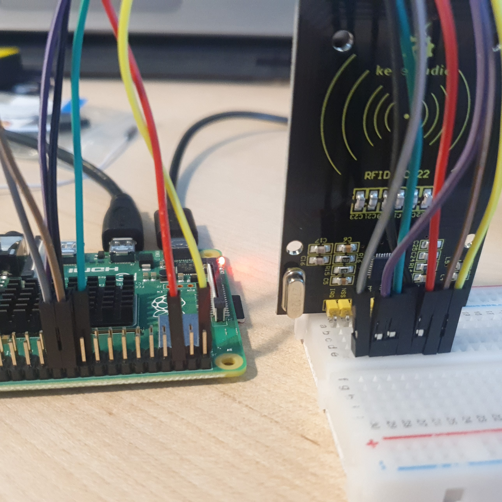

# RFID 연결

RFID를 연결하여 카드를 태그하여 이름을 등록한다. 

등록된 카드를 RFID 리더기에 태그하여 이름을 확인한다. 

<br>

### 준비물

+ RFID(RC522)

<br>

### 결선도


<br>

### 결선방법

SDA는 GPIO8에 연결한다.

SCK는 GPIO11에 연결한다.

MOSI는 GPIO10에 연결한다.

MISO는 GPIO9에 연결한다.

GND는 Ground에 연결한다.

RST는 GPIO25에 연결한다.

VCC는 3.3V에 연결한다.



<br>

### 예제코드 1

RFID 카드의 ID 번호를 식별해 카드 소유자의 이름을 등록한다. 

```python
import RPi.GPIO as GPIO
from mfrc522 import SimpleMFRC522

GPIO.setwarnings(False)
reader = SimpleMFRC522()

try:
        name = input('Name:')
        print("Now place your tag to write")
        reader.write(name)
        print("Complete Registration")
finally:
        GPIO.cleanup()
```

<br>

### 결과 1

```
Name : student1
Now place your tag to write
Complete
```

이름을 입력 받는다. 

카드를 태그하면 등록이 완료된다. 

<br>

### 예제코드 2

RFID 리더기에 카드를 태그하면 등록된 이름이 출력된다. 

```python
import RPi.GPIO as GPIO
from mfrc522 import SimpleMFRC522

GPIO.setwarnings(False)

reader = SimpleMFRC522()

try:
        print("Tag your card")
        id, name = reader.read()

        if id is None:
                print("Unregistered Card")

        else:
                print("ID :", id)
                print(name)
finally:
        GPIO.cleanup()
```

<br>

### 결과 2

```
Tag your card
ID : 525442989382
student1
```

카드를 태그하라는 텍스트가 출력된다. 

카드를 태그하면 ID와 함께 등록한 이름이 출력된다. 