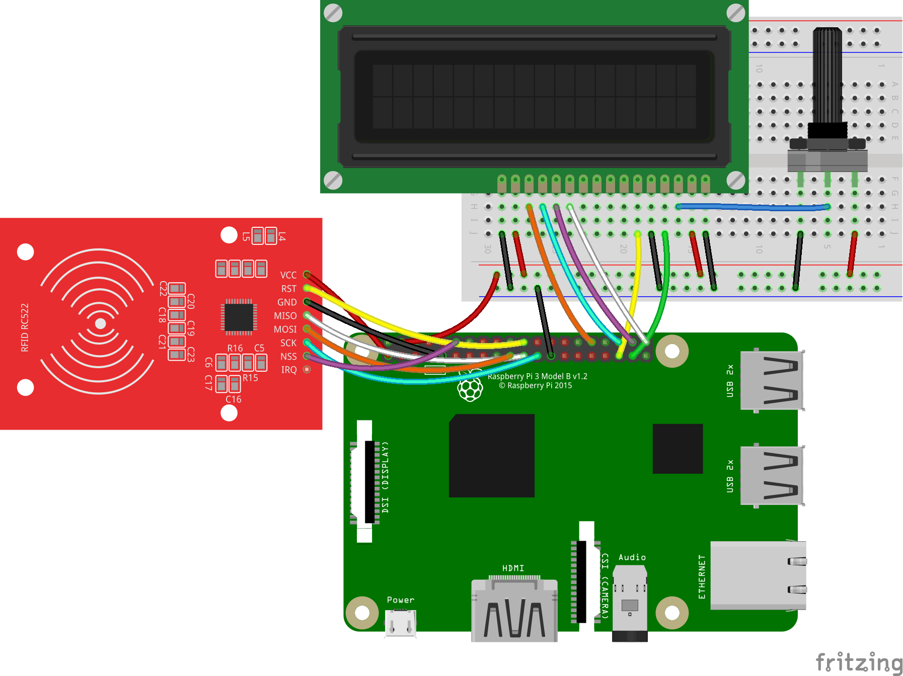
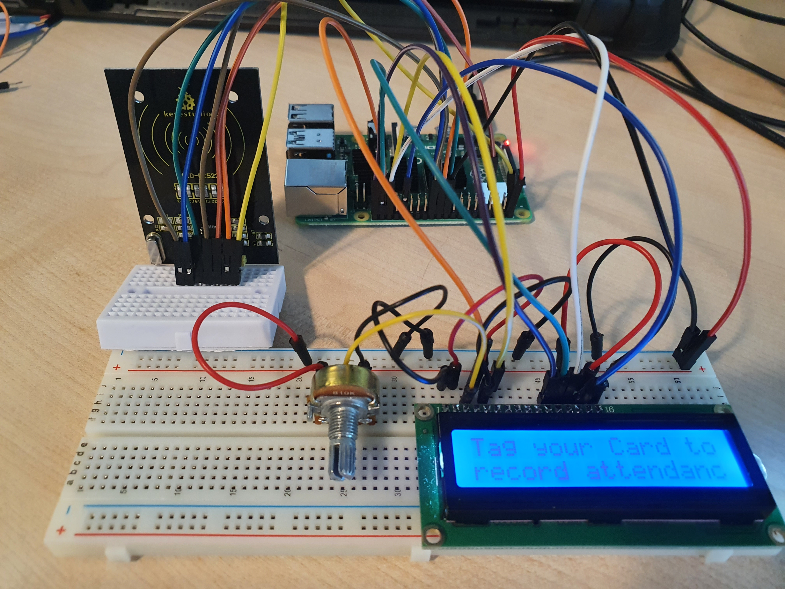
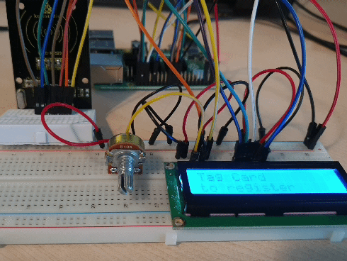

# RFID를 활용한 출석 시스템 2/3

RFID와 LCD를 연결하고, RFID로 학생을 등록하고 데이터베이스에 기록한다. 

<br>

## attendance 데이터베이스에 학생 기록

RFID를 태그하여 RFID의 ID와 학생의 이름을 Student 테이블에 저장한다.

### 결선도



<br>

### 결선방법

RFID의 SDA는 GPIO8에 연결한다.

RFID의 SCK는 GPIO11에 연결한다.

RFID의 MOSI는 GPIO10에 연결한다.

RFID의 MISO는 GPIO9에 연결한다.

RFID의 GND는 Ground에 연결한다.

RFID의 RST는 GPIO25에 연결한다.

RFID의 VCC는 3.3V에 연결한다.

LCD의 VDD와 A핀은 저항의 한 쪽을 통해서 5V에 연결한다. 

LCD의 VSS, RW, K핀은 저항의 반대쪽을 통해 GND에 연결한다. 

LCD의 VO핀은 저항의 가운데 연결한다. 

LCD의 RS핀은 GPIO26핀에 연결한다. 

LCD의 E핀은 GPIO19핀에 연결한다. 

LCD의 D4핀은 GPIO21핀에 연결한다. 

LCD의 D5핀은 GPIO20핀에 연결한다. 

LCD의 D6핀은 GPIO16핀에 연결한다. 

LCD의 D7핀은 GPIO12핀에 연결한다. 



<br>

### Student 테이블에 정보 등록하기

#### Python MYSQL Connector 설치

Python와 SQL 연결하는 Connector를 설치한다. 

```
sudo pip3 install mysql-connector-python
```

터미널에 위와 같이 입력해서 데이터베이스와 연결하는 패키지를 설치한다. 

#### 학생 등록 rsgister.py 작성

RFID를 태그하면 RFID의 ID 정보와 학생의 이름 및 등록 시간이 Student 테이블에 저장되는 Register.py 스크립트를 작성한다. 

```python
import time
import RPi.GPIO as GPIO
from mfrc522 import SimpleMFRC522
import mysql.connector
import board
import digitalio
import adafruit_character_lcd.character_lcd as characterlcd

db = mysql.connector.connect(
  host="localhost",
  user="atadmin",
  passwd="qwer",
  database="attendance"
)
# SQL 서버에 접속

cursor = db.cursor()
# 데이터베이스 연결을 위해 커서 개체의 복사본을 인스턴스화 하여 데이터베이스와 상호작용하고 SQL 쿼리를 실행

reader = SimpleMFRC522()
# SimpleMFRC522 라이브러리 준비

lcd_rs = digitalio.DigitalInOut(board.D26)
lcd_en = digitalio.DigitalInOut(board.D19)
lcd_d7 = digitalio.DigitalInOut(board.D12)
lcd_d6 = digitalio.DigitalInOut(board.D16)
lcd_d5 = digitalio.DigitalInOut(board.D20)
lcd_d4 = digitalio.DigitalInOut(board.D21)

lcd_columns = 16
lcd_rows = 2

lcd = characterlcd.Character_LCD_Mono(lcd_rs, lcd_en, lcd_d4, lcd_d5, lcd_d6, lcd_d7, lcd_columns, lcd_rows)

try:
  while True:
    lcd.clear()
    lcd.message = "Tag Card \nto register"
    id, text = reader.read()

    cursor.execute("SELECT id FROM students WHERE rfid_uid="+str(id))
    cursor.fetchone()
    # student 테이블에서 태그한 RFID UID와 일치하는 행이 있는지 확인

    if cursor.rowcount >= 1:
      lcd.clear()
      lcd.message = "Overwrite\nexisting user?"
      overwrite = input("Overwite (Y/N)? ")
      # SQL 호출에서 RFID UID가 확인되어 반환 된 경우 기존의 값을 덮어쓸지 여부를 확인

      if overwrite[0] == 'Y' or overwrite[0] == 'y':
        lcd.clear()
        lcd.message = "Overwriting user." 
        time.sleep(1)
        sql_insert = "UPDATE students SET name = %s WHERE rfid_uid=%s"
        # 덮어쓸 경우 기존 항목을 업데이트하는 SQL 쿼리 작성
      else:
        continue;
        # 덮어쓰지 않을 경우 루프의 처음 부분으로 돌아감
    else:
      sql_insert = "INSERT INTO students (name, rfid_uid) VALUES (%s, %s)"
      # 기존의 RFID UID가 확인되지 않은 경우 새 항목을 추가하는 SQL 쿼리 작성
    
    lcd.clear()
    lcd.message = "Enter new name"
    new_name = input("Name: ")
    # 이름을 입력 받음

    cursor.execute(sql_insert, (new_name, id))
    # 위에 작성한 SQL 쿼리에 값을 대입

    db.commit()
    # 데이터베이스에 변경 사항 적용

    lcd.clear()
    lcd.message = "Welcome \n" + new_name 
    time.sleep(2)
    
finally:
  GPIO.cleanup()
```

*** try catch finally

<br>

### 결과



LCD에 카드키를 태그하라는 문구가 출력된다. 

RFID에 카드를 태그한다. 

LCD에 새로 등록한 카드의 경우 이름을 입력하라는 메세지가 출력된다. 

이전에 등록되어 있는 카드의 경우 데이터를 덮어쓸지 물어본다. 

이름을 입력하면 반갑다는 인사 메세지와 함께 등록이 완료된다. 

등록된 데이터는 아래와 같이 student 테이블에 저장된다.

```
MariaDB [attendance]> select * from students;
+----+---------------+------+---------------------+
| id | rfid_uid      | name | created_time        |
+----+---------------+------+---------------------+
|  1 | 525442989382  | st1  | 2021-04-23 11:19:57 |
|  2 | 250110294918  | st2  | 2021-04-23 11:20:04 |
|  3 | 1077901114970 | st3  | 2021-04-23 11:20:10 |
|  4 | 760842419154  | st4  | 2021-04-23 11:20:17 |
+----+---------------+------+---------------------+
4 rows in set (0.001 sec)
```