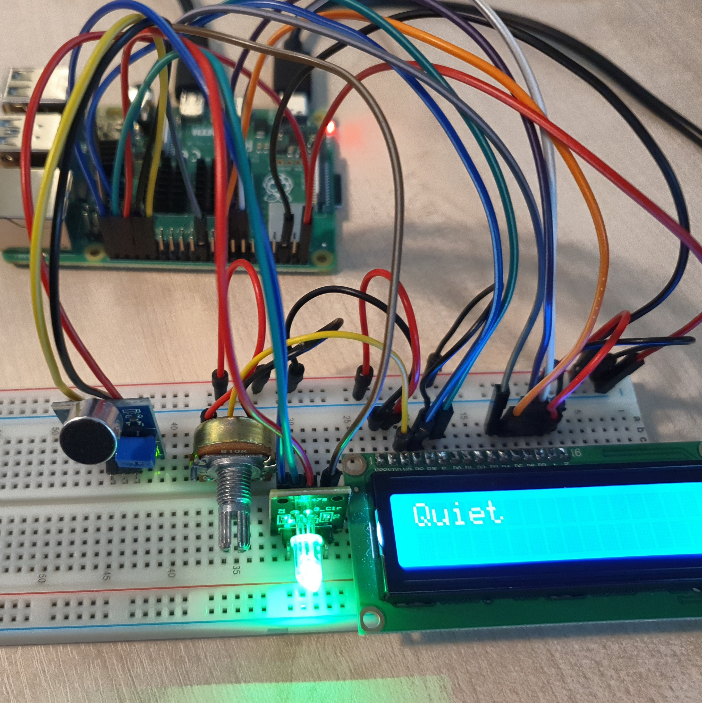

# Example 1 Noise Alarm

소음감지기로 주변의 소음을 감지하여 소음이 측정되면 LCD를 통해 텍스트가 출력된다.

소음이 감지되면 LED에 빨간불이 나오며 조용이 하라는 텍스트가 출력된다. 

소음이 감지되지 않으면 LED에 초록불이 나오며 조용하다는 텍스트가 출력된다. 

<br>

활용 : 

도서관이나 자습실 시험장 등 소음을 자제하고 조용히 해야하는 곳에 소음 경보기를 설치해 소음으로 인한 피해를 줄인다. 

<br>

### 준비물

+ 소음 감지 센서

+ RGBLED

+ LCD

+ Potentiomete

<br>

### 결선도


<br>

### 결선방법

소리 감지 센서의 VCC핀을 3V3에 연결한다. 

소리 감지 센서의 GND핀을 Ground에 연결한다.

소리 감지 센서의 OUT핀을 GPIO에 연결한다. 

RGBLED의 R, G, B 핀을 각각 GPIO 핀에 연결하고, GND 핀을 연결한다. 

LCD의 VDD와 A핀은 저항의 한 쪽을 통해서 5V에 연결한다. 

LCD의 VSS, RW, K핀은 저항의 반대쪽을 통해 GND에 연결한다. 

LCD의 VO핀은 저항의 가운데 연결한다. 

LCD의 RS핀은 GPIO26핀에 연결한다. 

LCD의 E핀은 GPIO19핀에 연결한다. 

LCD의 D4핀은 GPIO25핀에 연결한다. 

LCD의 D5핀은 GPIO24핀에 연결한다. 

LCD의 D6핀은 GPIO22핀에 연결한다. 

LCD의 D7핀은 GPIO27핀에 연결한다. 



<br>

### 예제코드

소음 감지 센서로 소음을 감지한다. 

소음이 감지되면 LCD를 통해 조용히하라는 텍스트가 출력되면서, RGBLED가 빨간불로 바뀐다. 

다시 소음이 감지되지 않으면 조용하다는 텍스트와 함께 RGB LED에는 초록불이 출력된다. 

```python
import board
import digitalio
import adafruit_character_lcd.character_lcd as characterlcd
from gpiozero import InputDevice
from time import sleep
from gpiozero import RGBLED

lcd_rs = digitalio.DigitalInOut(board.D26)
lcd_en = digitalio.DigitalInOut(board.D19)
lcd_d7 = digitalio.DigitalInOut(board.D27)
lcd_d6 = digitalio.DigitalInOut(board.D22)
lcd_d5 = digitalio.DigitalInOut(board.D24)
lcd_d4 = digitalio.DigitalInOut(board.D25)

lcd_columns = 16
lcd_rows = 2

lcd = characterlcd.Character_LCD_Mono(lcd_rs, lcd_en, lcd_d4, lcd_d5, lcd_d6, lcd_d7, lcd_columns, lcd_rows)

sensor = InputDevice(12, pull_up = True)

led = RGBLED(red=16, green=20, blue=21)

while True: 
    if sensor.value == 1:
        lcd.message = "Noisy"
        led.color = (1, 0, 0)
        sleep(1)

    else:
        lcd.message = "Quiet"
        led.color = (0, 1, 0)
        sleep(1)
```

<br>

### 결과


소음 감지 센서로 소음이 감지되면 RGBLED의 불빛이 빨간색으로 변하고 LCD를 통해 소음을 경고하는 "Noisy"라는 텍스트가 출력된다. 

다시 조용해지면 LED의 불빛은 초록빛으로 바뀌고 LCD의 텍스트는 "Quiet"로 바뀐다. 