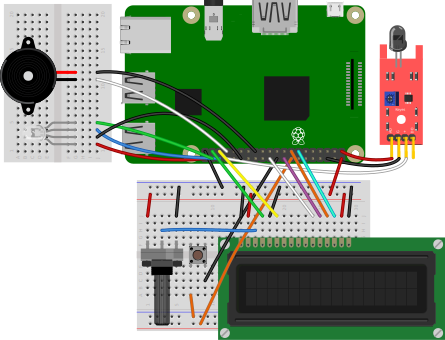
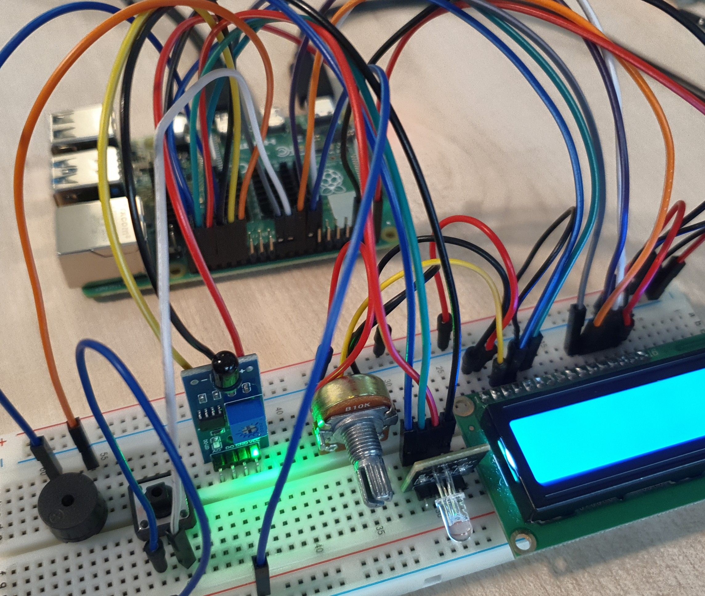

# Example 2 Fire Alarm

불꽃 감지 센서를 이용해 불꽃을 감지하는 장치를 만든다. 

불꽃이 감지되면 LCD를 통해 버튼을 누르라는 메세지가 출력된다. 

버튼을 누르면 버저가 울리고 RGB LED가 켜진다. 

<br>

활용 : 

화재 위험이 있는 공간에 설치하여 화재 상황을 감시한다. 

<br>

### 준비물

+ 불꽃 감지 센서

+ RGBLED

+ LCD

+ Potentiomete

+ Buzzer

+ Button

<br>

### 결선도



<br>

### 결선방법

RGBLED의 R, G, B 핀을 각각 GPIO 핀에 연결하고, GND 핀을 연결한다. 

LCD의 VDD와 A핀은 저항의 한 쪽을 통해서 5V에 연결한다. 

LCD의 VSS, RW, K핀은 저항의 반대쪽을 통해 GND에 연결한다. 

LCD의 VO핀은 저항의 가운데 연결한다. 

LCD의 RS핀은 GPIO26핀에 연결한다. 

LCD의 E핀은 GPIO19핀에 연결한다. 

LCD의 D4핀은 GPIO25핀에 연결한다. 

LCD의 D5핀은 GPIO24핀에 연결한다. 

LCD의 D6핀은 GPIO22핀에 연결한다. 

LCD의 D7핀은 GPIO27핀에 연결한다. 

버튼 한 쪽을 GPIO 핀에 연결하고 다른 한쪽은 저항을 통해 Ground로 연결한다. 

LED의 음극은 Ground로 연결하고, 양극은 저항을 통해 GPIO23핀에 연결한다.

버저의 한 쪽을 GPIO13핀에 연결한다. 

버저의 다른 한 쪽을 GND에 연결한다. 

불꽃감지기의 전원을 3v3에 연결한다. 

불꽃감지기의 GND 핀을 Ground에 연결한다. 

불꽃감지기의 신호(-)핀을 GPIO12핀에 연결한다. 



<br>

### 예제코드

불꽃 감지 센서에 불꽃이 감지되면 LCD를 통해 버튼을 누르게 한다. 

버튼을 누르면 RGBLED와 버저를 통해 화재 경보를 한다. 

```python
import board
import digitalio
import adafruit_character_lcd.character_lcd as characterlcd
from gpiozero import InputDevice
from time import sleep
from gpiozero import RGBLED
from gpiozero import Button
from gpiozero import Buzzer

lcd_rs = digitalio.DigitalInOut(board.D26)
lcd_en = digitalio.DigitalInOut(board.D19)
lcd_d7 = digitalio.DigitalInOut(board.D27)
lcd_d6 = digitalio.DigitalInOut(board.D22)
lcd_d5 = digitalio.DigitalInOut(board.D24)
lcd_d4 = digitalio.DigitalInOut(board.D25)

lcd_columns = 16
lcd_rows = 2

lcd = characterlcd.Character_LCD_Mono(lcd_rs, lcd_en, lcd_d4, lcd_d5, lcd_d6, lcd_d7, lcd_columns, lcd_rows)

sensor = InputDevice(12, pull_up = True)

led = RGBLED(red=16, green=20, blue=21)

button = Button(23)

bz = Buzzer(13)

def fire():
    while True:
        led.color = (1, 0, 0)
        sleep(0.5)
        led.color = (0, 1, 0)
        sleep(0.5)
        led.color = (1, 1, 0)
        sleep(0.5)
        led.color = (0, 1, 1)
        sleep(0.5)
        bz.beep()

while True: 
    if sensor.is_active:
        lcd.message = "Fire detedted\nPress the button"
        button.when_pressed = fire
        
    else:
        lcd.message = "No Fire"
        led.color = (0, 0, 0)
```

<br>

### 결과


불꽃이 감지되면 LCD에 'Fire detedted Press the button' 텍스트가 출력된다. 

버튼을 누르면 버저가 울리고 RGBLED가 여러가지 색으로 깜빡인다. 

불꽃이 감지되지 않으면 LCD에 'No Fire'라고 출력된다. 