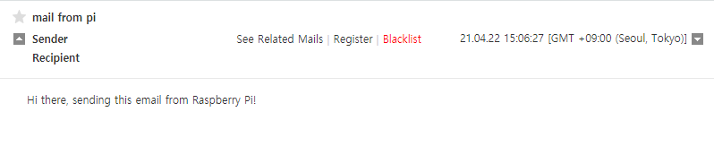

# Example 3 Send E-mail

라즈베리파이에서 파이썬을 이용해 메일을 전송하는 방법을 알아본다. 

<br>

SMPT란 Simple Mail Transfer Protocol의 줄임말로 간의 우편 전송 프로토콜을 의미한다. 

인터넷에서 이메일을 보내기 위한 프로토콜 신호이다. 

SMPT를 이용하여 라즈베리파이를 통해 이메일을 보낼 수 있다. 

### 예제코드

```python
import smtplib
from email.mime.text import MIMEText
from email.mime.multipart import MIMEMultipart
from email.mime.base import MIMEBase
from email import encoders

email_user = "sender email address"
# 보내는 사람의 이메일 주소
email_password = "password"
# 이메일 비밀번호
email_send = "receiver email address"
# 받는 사람의 이메일 주소

subject = "mail from pi"
# 이메일 제목

msg = MIMEMultipart()
msg["From"] = email_user
msg["To"] = email_send
msg["Subject"] = subject

body = "Hi there, sending this email from Raspberry Pi!"
# 이메일 내용
msg.attach(MIMEText(body,"plain"))

text = msg.as_string()
server = smtplib.SMTP("SMTP sever name", SMTP port number)
# 이메일 SMTP 서버 연결 
server.starttls()
server.login(email_user,email_password)


server.sendmail(email_user,email_send,text)
server.quit()
```

<br>

### 결과



위와 같이 이메일이 도착한다. 

<br>

라즈베리파이의 전원이 켜지면 알람 메일을 보내거나, 센서가 작동하면 경고 메일을 보내는 등 다양하게 활용이 가능하다. 